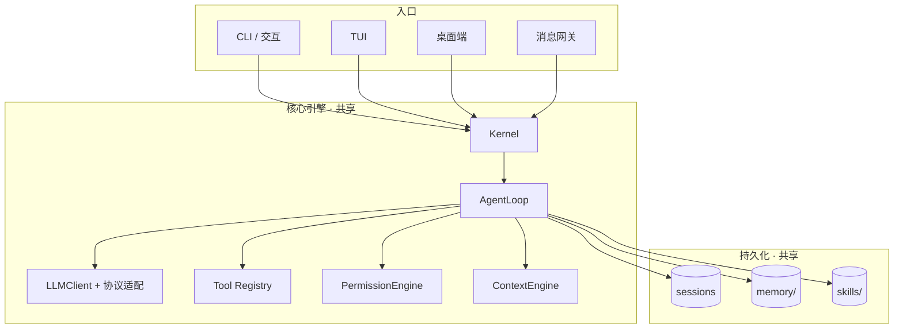

# Chrysalis

Chrysalis 是一个本地通用 Agent 运行时。它不只是接一个大模型聊天，而是把**模型 + 工具 + 记忆 + 权限 + 会话**组装成一个能在你本机真正做事的 Agent：读文件、写文件、跑脚本、操作浏览器、维护会话历史、沉淀长期经验，并通过"思考 → 调工具 → 看结果 → 再思考"的循环把任务做完。

```text
普通聊天机器人：你问一句，它答一句。
Chrysalis：你给一个目标，它按步骤调用本机工具，把任务真的做完。
```

> 📖 **完整文档（强烈推荐）**：[https://hsdaoqi.github.io/Chrysalis-Agent/](https://hsdaoqi.github.io/Chrysalis-Agent/)
>
> 文档站是一本"边讲原理边拆源码"的小书，从安装一路讲到每个子系统怎么实现。本 README 只做最小入门。

## 它能做什么

- **一套内核，多个入口**：CLI、连续交互、TUI、Electron 桌面端、QQ/微信/飞书网关，背后是同一个 Kernel，共享会话、配置、权限、记忆。
- **OpenAI / Anthropic 双协议**：内部统一的 canonical history，出口处再转协议，支持多模型 Failover。
- **工具调用闭环**：文件读写、代码执行、浏览器、网页抓取、截图、OCR、子 Agent、技能管理，全部经权限引擎把关。
- **四层记忆**：会话历史、单任务工作记忆、长期事实/SOP、可复用技能库。
- **长任务不爆上下文**：运行时分级压缩历史并修复工具配对。
- **本地安全边界**：三档权限控制，危险动作执行前确认。

## 架构一览



## 快速开始

需要 Python 3.11+ 和一个可用的大模型 API Key。

```bash
# 1. 克隆并安装
git clone https://github.com/hsdaoqi/Chrysalis-Agent.git
cd Chrysalis-Agent
pip install -e .

# 2. 配置模型
cp .env.example .env      # Windows: Copy-Item .env.example .env
# 编辑 .env，填入 API Key、base_url、model

# 3. 跑第一个任务
chrysalis "请读取 README.md，告诉我这个项目能做什么"
```

最小 `.env`：

```text
CHRYSALIS_LLM_PROVIDER=openai
CHRYSALIS_API_KEY=sk-xxx
CHRYSALIS_BASE_URL=https://api.example.com/v1
CHRYSALIS_MODEL=your-model-name
CHRYSALIS_PERMISSION_LEVEL=balanced
```

## 其他入口

```bash
chrysalis --interactive          # 连续交互模式（会话、队列、cron）
chrysalis --tui                  # 终端 UI（需 pip install -e ".[tui]"）
chrysalis-gateway qq-personal    # 消息网关（需 pip install -e ".[gateway]"）
```

桌面端：

```bash
cd desktop-electron && npm install && npm run dev
```

可选能力按需安装：

```bash
pip install -e ".[tui]"       # 终端 UI
pip install -e ".[vision]"    # 截图 / 图片输入
pip install -e ".[ocr]"       # OCR
pip install -e ".[voice]"     # 语音输入
pip install -e ".[gateway]"   # 消息网关
pip install -e ".[dev]"       # 测试
```

## 想读懂或改造它？

文档站的 [Agent 原理教程](https://hsdaoqi.github.io/Chrysalis-Agent/tutorial/overview.html) 是一本结合本项目真实代码的教科书式教程，建议按顺序读：

1. [Agent 是什么](https://hsdaoqi.github.io/Chrysalis-Agent/tutorial/overview.html)
2. [Kernel 装配与观察-行动循环](https://hsdaoqi.github.io/Chrysalis-Agent/tutorial/kernel-and-loop.html)
3. [LLM History 与会话存储](https://hsdaoqi.github.io/Chrysalis-Agent/tutorial/llm-history.html)
4. [LLM 协议适配层](https://hsdaoqi.github.io/Chrysalis-Agent/tutorial/llm-protocol.html)
5. [上下文压缩](https://hsdaoqi.github.io/Chrysalis-Agent/tutorial/context-compaction.html)
6. [工具调用](https://hsdaoqi.github.io/Chrysalis-Agent/tutorial/tools.html)
7. [权限系统](https://hsdaoqi.github.io/Chrysalis-Agent/tutorial/permission.html)
8. [工作记忆](https://hsdaoqi.github.io/Chrysalis-Agent/tutorial/working-memory.html)
9. [长期记忆](https://hsdaoqi.github.io/Chrysalis-Agent/tutorial/long-term-memory.html)
10. [技能库](https://hsdaoqi.github.io/Chrysalis-Agent/tutorial/skills.html)
11. [子 Agent、网关与桌面端](https://hsdaoqi.github.io/Chrysalis-Agent/tutorial/architecture-extras.html)
12. [动手扩展 Chrysalis](https://hsdaoqi.github.io/Chrysalis-Agent/tutorial/extending.html)

## 测试

```bash
pip install -e ".[dev]"
pytest
```

## 许可证

MIT
