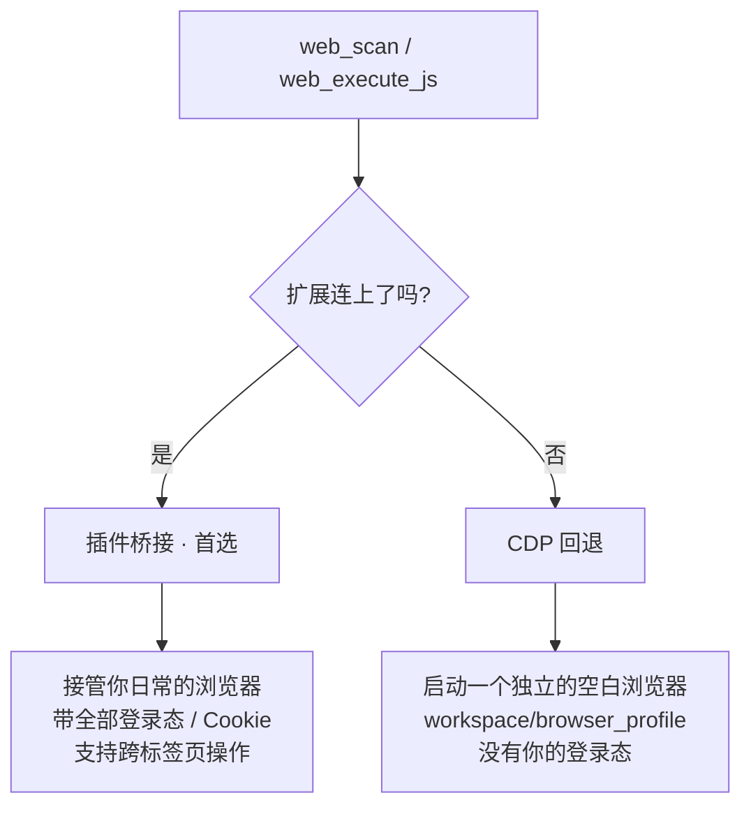
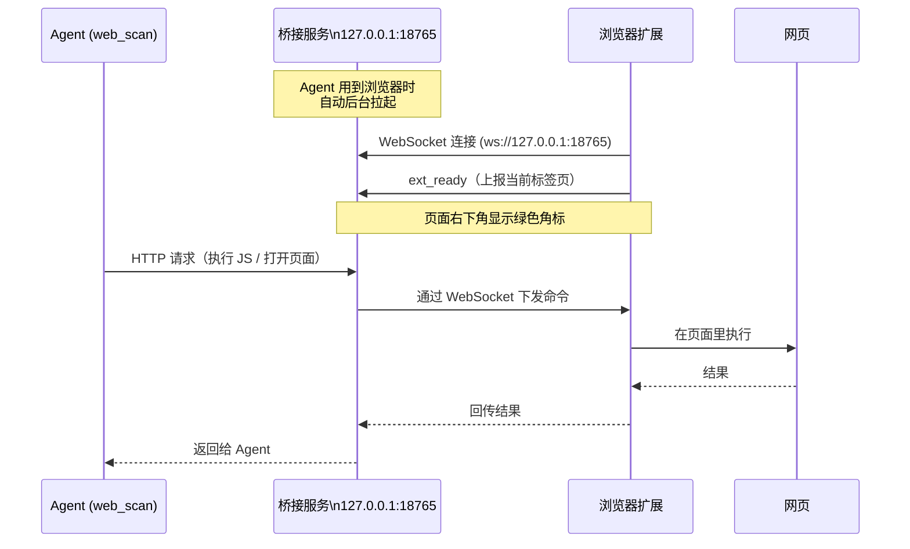
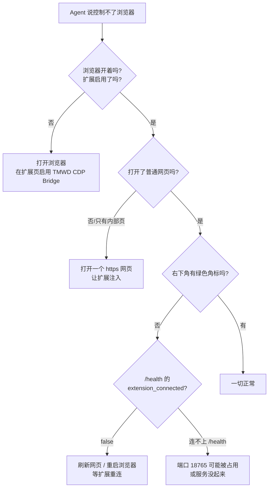

# 安装浏览器扩展（让 Agent 控制你的浏览器）

Chrysalis 可以操作真实浏览器：打开网页、读取页面内容、点击、填表、执行 JavaScript。要让它接管你**日常正在用的浏览器**（带着你已有的登录态和 Cookie），需要装一个浏览器扩展。这一页手把手教你装好它。

::: tip 一句话原理
扩展 = 浏览器和 Chrysalis 之间的一座桥。装好后，Agent 调用 `web_scan`、`web_execute_js` 这些工具时，命令会通过本地的桥接服务传到扩展，扩展再在你的浏览器页面里执行。整套链路全在你本机（`127.0.0.1`），不经过任何外部服务器。
:::

## 为什么需要扩展

先理解 Chrysalis 控制浏览器的两条路，你就知道为什么强烈建议装扩展。

`web_scan` / `web_execute_js` 这两个工具有两个后端，会自动按优先级选择：



| | 装了扩展（插件桥接） | 没装扩展（CDP 回退） |
| --- | --- | --- |
| 控制的浏览器 | 你**日常正在用**的那个 | 一个临时的**空白**浏览器 |
| 登录态 / Cookie | ✅ 全部保留 | ❌ 没有，什么都没登录 |
| 适合做什么 | 操作需要登录的网站、读你已打开的页面 | 只能访问公开页面 |

> 关键区别：从 Edge / Chrome 136 起，CDP 模式**不能调试你的默认浏览器配置**，所以回退路径只能开一个独立的空白配置（`workspace/browser_profile`）——里面没有你的任何登录信息。想让 Agent 帮你操作微博、淘宝、公司内网这类**需要登录**的网站，就必须装扩展。

扩展只需装**一次**，之后永久生效。

## 准备工作

| 你需要 | 说明 |
| --- | --- |
| Chrome 或 Edge 浏览器 | 扩展基于 Chrome 扩展标准（Manifest V3），两者都支持 |
| 已经克隆好的 Chrysalis 项目 | 扩展文件就在项目里的 `assets/tmwd_cdp_bridge/` 目录 |

扩展的文件位置（确认一下它在）：

```text
Chrysalis/
  assets/
    tmwd_cdp_bridge/        ← 就是这个目录
      manifest.json
      background.js
      content.js
      popup.html
      ...
```

## 安装步骤

下面以 Edge 为例，Chrome 完全一样，只是扩展管理页地址不同。

### 第 1 步：打开扩展管理页

在浏览器地址栏输入对应地址，回车：

- **Edge**：`edge://extensions`
- **Chrome**：`chrome://extensions`

### 第 2 步：打开「开发者模式」

在扩展管理页找到「开发者模式」开关（Edge 在左下角，Chrome 在右上角），把它**打开**。

打开后，页面顶部会多出几个按钮，包括「加载解压缩的扩展」（Chrome 叫「加载已解压的扩展程序」）。

### 第 3 步：加载扩展

点「加载解压缩的扩展」，在弹出的文件选择框里，选中项目里的这个目录：

```text
<你的项目路径>/assets/tmwd_cdp_bridge
```

::: warning 选目录，不是选文件
要选中 `tmwd_cdp_bridge` **这个文件夹本身**，不要进到文件夹里去选某个 `.js` 文件。浏览器需要的是整个目录。
:::

选好后点确定。扩展列表里就会出现一个叫 **「TMWD CDP Bridge」** 的扩展。看到它说明加载成功了。

### 第 4 步：打开一个普通网页，确认连接

扩展装好后不会立刻工作——它需要你**打开一个普通网页**才会激活。

新开一个标签页，访问任意普通网站（比如 `https://www.baidu.com`）。注意：

- ✅ 普通网页（`https://...` 开头的网站）
- ❌ 浏览器内部页（`about:blank`、`edge://...`、`chrome://...`）和扩展管理页都不行，扩展无法注入这些页面

页面加载完后，**右下角会出现一个绿色小角标**：

```text
┌─────────────────────┐
│                     │
│      网页内容        │
│                     │
│         ┌─────────┐ │
│         │ ljq_driver: 已连接 │  ← 绿色角标
└─────────┴─────────┴─┘
```

角标文字是 **`ljq_driver: 已连接`**，绿色背景。看到它，就代表扩展已经成功连上了 Chrysalis 的本地桥接服务，一切就绪。

## 它是怎么连上的

你可能好奇：扩展装好后，是怎么和 Chrysalis 通信的？理解这一点能帮你排查问题。



几个关键点：

1. **桥接服务不用你手动开**。Agent 第一次用到浏览器工具时，会自动在后台把桥接服务（`chrysalis/browser_bridge.py`）拉起来，监听 `127.0.0.1:18765`。
2. **扩展主动找服务**。扩展装好后会不断探测这个端口，一旦发现服务在跑，就用 WebSocket 连上去，并显示绿色角标。
3. **全程本机**。命令在 `127.0.0.1` 上传递，不出你的电脑。
4. **服务挂了会自动重连**。扩展用定时探测保活，服务重启后会自动重新连上。

如果你想手动启动桥接服务（一般不需要）：

```bash
python -m chrysalis.browser_bridge
```

## 验证一切正常

装好扩展、打开网页看到绿色角标后，让 Agent 试一个需要浏览器的任务：

```bash
chrysalis "用浏览器打开 https://news.ycombinator.com，告诉我首页前三条标题"
```

如果扩展工作正常，Agent 会读取**你浏览器里**的页面并回答。

你也可以直接检查桥接服务状态。在浏览器访问：

```text
http://127.0.0.1:18765/health
```

正常会返回类似：

```json
{
  "ok": true,
  "chrysalis": true,
  "name": "chrysalis_browser_bridge",
  "extension_connected": true
}
```

重点看 `extension_connected`：

- `true` —— 扩展已连上，可以接管你的浏览器了。
- `false` —— 服务在跑但扩展没连上，回到[第 4 步](#第-4-步-打开一个普通网页-确认连接)，打开一个普通网页激活扩展。

## 权限说明：扩展为什么要这么多权限

加载扩展时，浏览器可能提示它申请了不少权限（`cookies`、`debugger`、`scripting`、`tabs` 等）。这是因为"代表你操作浏览器"本身就需要这些能力：

| 权限 | 为什么需要 |
| --- | --- |
| `tabs` / `activeTab` | 读取和切换标签页，知道你打开了哪些页面 |
| `scripting` / `debugger` | 在页面里执行 JavaScript（这是"控制"的核心） |
| `cookies` | 读取登录态，让 Agent 能操作已登录的网站 |
| `<all_urls>` | 能在任意网站上工作，而不限于某几个域名 |

::: warning 安全提醒
这是一个**功能强大**的扩展——它能读取你浏览器里几乎所有内容、在任意页面执行脚本。请只在你自己的、可信的电脑上安装它。它的所有通信都限于本机 `127.0.0.1`，不会把数据发往外部，但它确实给了 Chrysalis 操作你浏览器的完整能力。如果你不需要 Agent 操作需要登录的网站，可以不装扩展，只用 CDP 回退模式或 `web_fetch` 抓公开页面。
:::

## 常见问题排查

按这个顺序检查，绝大多数问题都能定位：



具体对照：

| 现象 | 原因 | 解决 |
| --- | --- | --- |
| 看不到绿色角标 | 当前是内部页（`about:`/`edge:`）或扩展没注入 | 打开一个普通 `https://` 网页，刷新一下 |
| Agent 说"临时空白浏览器（无登录态）" | 走了 CDP 回退，扩展没连上 | 按本页步骤装好并启用扩展，打开普通网页激活 |
| `/health` 打不开 | 桥接服务没在跑 | 跑一个用到浏览器的任务自动拉起，或手动 `python -m chrysalis.browser_bridge` |
| `/health` 里 `extension_connected: false` | 服务在跑但扩展没连 | 刷新网页或重启浏览器，扩展会自动重连 |
| 装扩展后报清单错误 | 选错了目录 | 确认选的是 `assets/tmwd_cdp_bridge` 文件夹本身 |
| `web_execute_js` 拿不到返回值 | 用了 `await` 但没 `return` | 脚本里需要显式 `return`（见下方提示） |

::: tip web_execute_js 的一个坑
在 `web_execute_js` 里写异步代码时，想拿到返回值必须**显式 `return`**。比如：

```javascript
// ✅ 正确
const res = await fetch('/api/data');
return await res.json();

// ❌ 拿不到结果
await fetch('/api/data');
```
:::

## 还是连不上？

如果上面都试过仍然不行，可能是端口 `18765` 被其他程序占用，或浏览器有特殊安全策略。这时建议：

1. 确认没有别的程序占用 `18765` 端口。
2. 完全关闭浏览器再重开，重新打开一个普通网页。
3. 在扩展管理页点一下扩展的「重新加载」按钮。

仍然不行的话，可以让 Agent 退回到不依赖浏览器登录态的 `web_fetch`（抓公开网页），或在 CDP 回退模式下操作（独立空白浏览器）。

## 下一步

- 想理解浏览器工具在整个工具体系里的位置 → [第 6 章：工具调用](/tutorial/tools)
- 想理解 `web_scan` / `web_execute_js` 为什么要经过权限确认 → [第 7 章：权限系统](/tutorial/permission)
