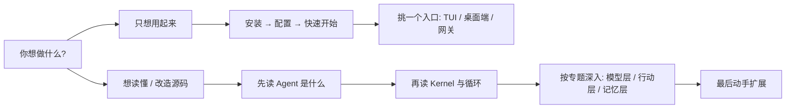

## 这套文档怎么读

Chrysalis 的文档分成两部分。你不需要从头读到尾，按自己的目标挑就行。

### 第一部分：上手使用（`guide/`）

如果你只想先把它用起来，按顺序读这几篇就够：

1. [安装指南](/guide/installation) —— 把环境和命令装好。
2. [配置模型](/guide/configuration) —— 让模型 API 连得上，理清三层配置优先级。
3. [快速开始](/guide/quickstart) —— 实际跑一个任务，体验工具调用、权限确认、会话与队列。
4. 然后按喜好挑一个入口：[TUI 终端界面](/guide/tui)、[Electron 桌面端](/guide/desktop) 或 [消息网关](/guide/gateway)。

### 第二部分：Agent 原理（`tutorial/`）

如果你想读懂 Chrysalis 是怎么工作的，甚至想改造它，这部分是一本“边讲原理边拆源码”的小书。每一章都从一个真实问题出发，带你读真实代码，配流程图，并在结尾给动手练习。

建议从 [第 1 章：Agent 是什么](/tutorial/overview) 开始顺着读。如果你只关心某个子系统，也可以直接跳：

- 想搞清楚一次任务怎么跑完整个闭环 → [第 2 章 Kernel 与循环](/tutorial/kernel-and-loop)
- 想接入新模型 / 理解协议转换 → [第 4 章 LLM 协议适配层](/tutorial/llm-protocol)
- 想加一个新工具 → [第 6 章 工具调用](/tutorial/tools) + [第 12 章 动手扩展](/tutorial/extending)
- 想搞懂权限边界 → [第 7 章 权限系统](/tutorial/permission)
- 想让 Agent 记住经验 → [第 8~10 章 记忆与技能](/tutorial/working-memory)

::: tip 一句话理解 Chrysalis
普通聊天机器人是“你问一句、它答一句”。Chrysalis 是“你给一个目标，它按步骤调用本机工具，把任务真的做完”。这套文档讲的就是它如何做到这一点。
:::
