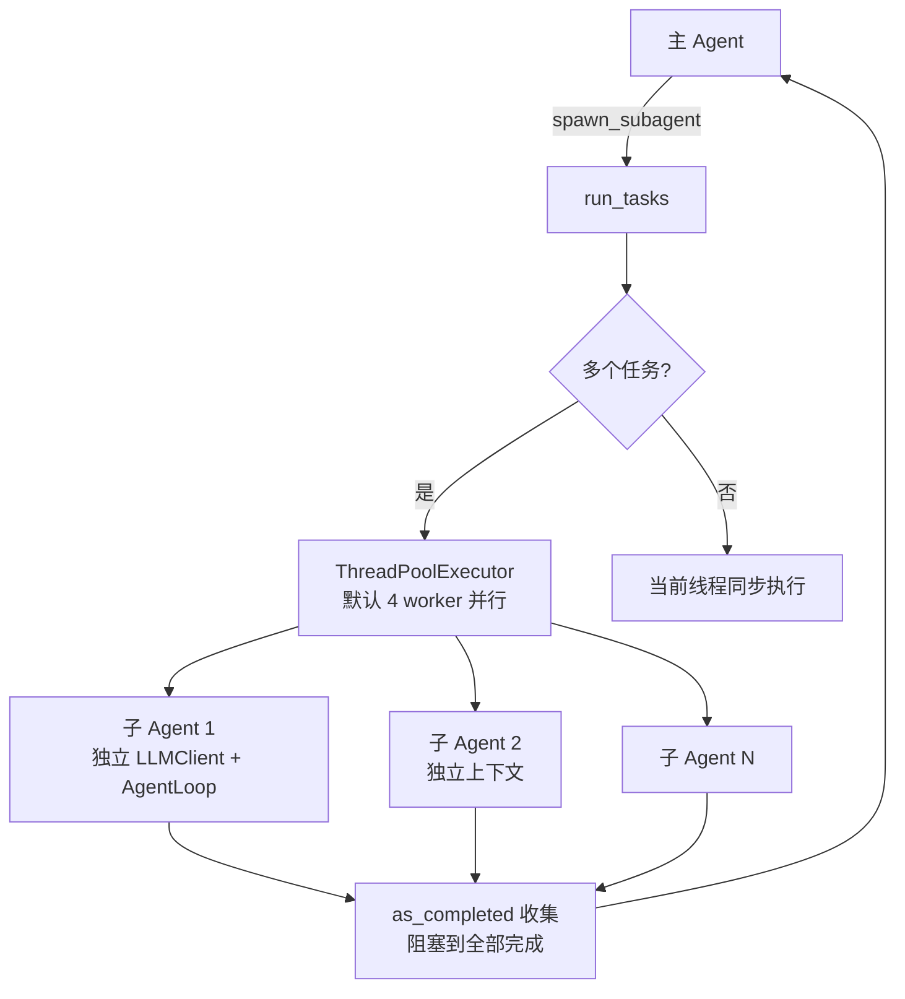
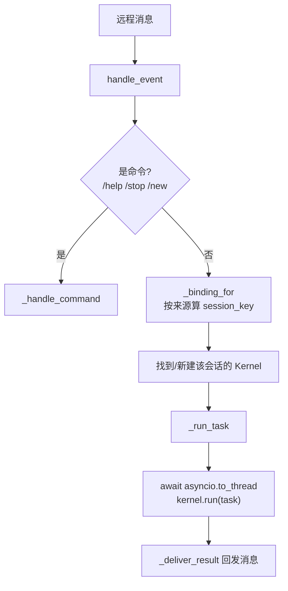
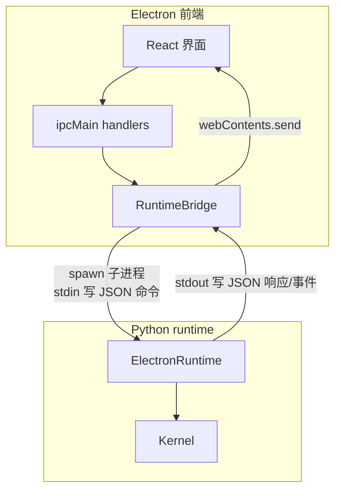
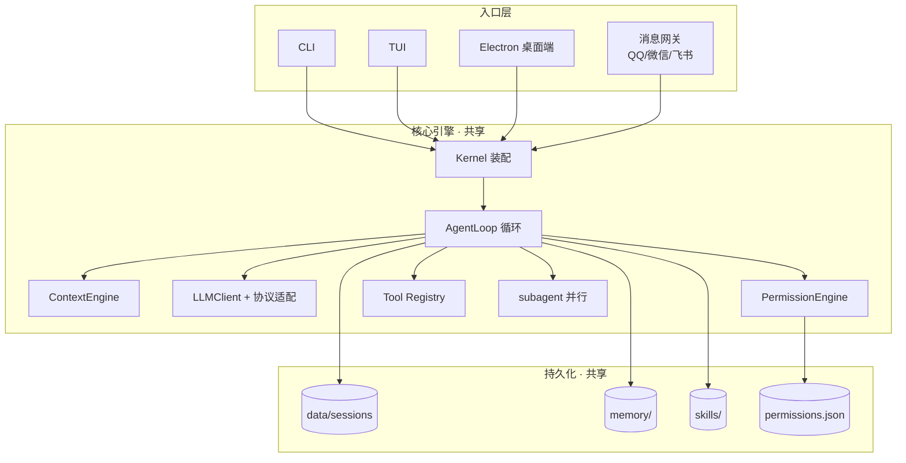

# 第 11 章：子 Agent、网关与桌面端

前面十章把 Chrysalis 的核心引擎讲透了。这一章看三个建立在引擎之上的"扩展形态"：子 Agent（让一个 Agent 派生多个 Agent 并行干活）、消息网关（把 Agent 接到 QQ/微信/飞书）、Electron 桌面端（图形界面）。

贯穿这三者的，是第 1 章就说的那句话——**它们都复用同一个 `Kernel`**。理解这一点，你就理解了整个项目的架构哲学。

## 11.1 子 Agent：并行干活

### 问题：一个 Agent 串行太慢

有些任务天然可以拆成互相独立的子任务。比如"分别总结 5 个网页"——这 5 件事谁先谁后无所谓，串行做要等 5 倍时间。如果能派 5 个"分身"同时干，就快多了。

这就是 `spawn_subagent` 工具（第 6 章清单里有）。它的实现委托给 `chrysalis/subagent.py`。

### 子 Agent 怎么跑

`spawn_subagent`（`agent_tools.py:92`）支持传一批任务，调用 `subagent.run_tasks()`（`subagent.py:32`）：



每个子 Agent（`_run_subagent`，`subagent.py:78`）：

```python
child_llm = create_client(_session_config)                      # 独立 LLM client → 独立上下文
child_tools = generate_tools_schema(exclude={"spawn_subagent"}) # 禁止再派生
loop = AgentLoop(llm=child_llm, max_turns=SUBAGENT_MAX_TURNS,    # 上限 10 轮
                 tools_schema=child_tools, ...)
result = loop.run(task, session_context=context)
```

几个关键设计：

- **独立上下文**：每个子 Agent 用 `create_client()` 新建独立的 `LLMClient` 和 `AgentLoop`，不共享主 Agent 的历史。它们只复用 `SessionConfig`（模型、key 等）。这样子任务之间互不干扰。
- **真并行**：多任务时用 `ThreadPoolExecutor`（默认 4 个 worker）并行执行，`as_completed` 收集，阻塞到全部完成才把结果返回主 Agent。
- **禁止递归派生**：两道防线——工具 schema 里 `exclude={"spawn_subagent"}` 让子 Agent 看不到这个工具；运行时还检查线程标记（`_subagent_threads`），子 Agent 所在线程不能再调 `run_tasks`。这避免了"分身又生分身"的失控。
- **子 Agent 不能问用户**：它的系统提示词要求"完成后立即返回 final，不要询问用户"；如果返回 `need_user`，会被当成失败。因为子任务在后台并行跑，没法逐个停下来问你。

### 什么时候用子 Agent

适合：互相独立的检索、总结、检查类任务。不适合：需要共享大量中间状态、或需要频繁人工介入的任务。

::: warning 一个共享点
`subagent.configure()` 设置的是**模块级全局**状态（`_session_config`、`_executor`），由每次构造 `Kernel` 时调用（`kernel.py:93`）。在桌面端/网关这种多 Kernel 并存的场景下，最后构造的 Kernel 会覆盖这份全局配置。读源码时留意这一点。
:::

## 11.2 消息网关：把 Agent 接到聊天软件

### 一套服务，多个平台

网关让你在 QQ/微信/飞书里 @ 机器人就能用 Chrysalis。入口是 `chrysalis-gateway`（`gateway/main.py`）。平台经 `PLATFORM_ALIASES` 归一成四个内部平台：

| 你输入的 | 内部平台 | 说明 |
| --- | --- | --- |
| `qq` | `qq` | QQ 官方开放平台 Bot |
| `qq-personal` / `onebot` / `napcat` | `qq_personal` | 个人 QQ（OneBot/NapCat 后端） |
| `wechat` / `wx` | `wechat_personal` | 个人微信 |
| `feishu` / `lark` | `feishu` | 飞书自建应用 |

注意：**没有独立的 `onebot` 平台**——它被归到 `qq_personal`。所有平台的 adapter 共享**同一个 `GatewayService` 实例**（`main.py:61`）。

### 远程消息怎么变成 Kernel 任务

核心在 `GatewayService`（`service.py:130`）。一条远程消息的旅程：



关键点：

- **每个聊天会话绑定一个 Kernel 实例**（`SessionBinding`），并通过 `GatewaySessionMap` 把 session_key 持久化到 `gateway_sessions.json`。这样同一个群/同一个人跨进程重启还能恢复到原会话。
- **`kernel.run` 丢进线程池**（`asyncio.to_thread`，`service.py:250`）。因为 `Kernel.run` 是同步阻塞的，而网关是 async 事件循环，丢到线程池才不会卡住整个网关。
- **网关复用的就是 `Kernel.run`**——和 CLI、桌面端走的是同一个方法。这再次印证"一套内核"。

### 安全：默认不信任远程

这是网关最重要的设计，第 7 章 7.6 节讲过。看 `_create_gateway_kernel()`（`service.py:196`）：

```python
kernel = Kernel(config=self.config, session_id=session_id)
if trusted_host:
    return kernel                                    # 只有官方 QQ 用完整权限
permission_engine = GatewayPermissionEngine(allowed_read_roots=...)
kernel.loop.permission_engine = permission_engine    # 换成网关权限引擎
exclude = set(get_registry()) - allowed_tools
kernel.loop.tools_schema = generate_tools_schema(exclude=exclude)  # 砍掉危险工具
```

非可信平台会被换上 `GatewayPermissionEngine`，并从工具 schema 里**移除所有不在白名单里的工具**——模型连这些工具的存在都看不到。只有 `qq`（官方 Bot，`TRUSTED_HOST_GATEWAY_PLATFORMS`）被当作可信宿主，用完整权限。

记住第 7 章的结论：远程用户**无法批准**本机权限请求（`resolve_user_choice` 恒返回 deny）。所以网关本质上只能用那批安全工具。要额外开放，用 `CHRYSALIS_GATEWAY_ALLOWED_TOOLS`，且务必确认环境可信。

## 11.3 Electron 桌面端：图形界面

### 架构：Electron 前端 + Python runtime

桌面端不是用 JavaScript 重写了一个 Agent，而是**前端（Electron/TypeScript）+ 后端（Python Kernel）** 的组合。两者通过一个 JSONL 桥通信。



后端核心是 `chrysalis/electron_runtime.py` 里的 `ElectronRuntime`。它是一个 **JSONL stdin/stdout 桥**：

- `serve()`（`electron_runtime.py:216`）逐行读 stdin，每行是一条 JSON 命令（`run_task`、`load_session`、`snapshot`…），交给 `_handle_command` 分发。
- 输出两类消息：**响应**（`{"type":"response","request_id":...}`，回答某条请求）和**事件**（`{"type":"event","event":...}`，主动推送的流式更新，如 `stream`、`thinking`、`tool_started`、`task_done`）。

前端的 `RuntimeBridge`（`desktop-electron/electron/runtimeBridge.ts`）负责启动这个 Python 进程：

- 开发态直接跑 `python -m chrysalis.electron_runtime`；打包态跑捆绑的 `chrysalis-runtime.exe`。
- 用 `spawn` 起子进程，`readline` 逐行读它的 stdout，按 `request_id` 匹配响应、按 event 名转发事件给 React 界面。
- 双方都设了 UTF-8 + 行缓冲，保证中文不乱码。

所以"点一个按钮"的完整链路是：React → `ipcMain.handle('chrysalis:runTask')` → `RuntimeBridge.request('run_task')` → 写进 Python stdin → `ElectronRuntime` 调 `Kernel.run` → 流式事件经 stdout 推回 → 界面实时更新。

### 三端怎么共享会话

桌面端、CLI、TUI、网关，**全部构造同一个 `Kernel` 类**，只是谁来驱动不同：

| 入口 | 谁驱动 Kernel |
| --- | --- |
| CLI | `kernel.py::main` 直接调 `.run()` |
| TUI | `tui/bridge.py` 持有 Kernel |
| 桌面端 | `ElectronRuntime` 持有常驻 Kernel |
| 网关 | `GatewayService` 每会话一个 Kernel |

共享的根基在 `Kernel.__init__`（第 2 章）里：所有端都用 `SessionStore(config.data_dir / "sessions")` 读写**同一个目录**的会话文件，都用同源的 `AgentConfig`。所以：

> 你在 CLI 跑的会话，桌面端能直接 `load_session` 打开；你在桌面端改的模型设置，CLI 也会读到。会话、配置、记忆、权限——全部共享。

桌面端甚至能**旁观网关**：网关把活动写进 `gateway_activity.json`，桌面端轮询读取，把网关里正在跑的会话也显示在自己的会话列表里。这是"一套内核多个前端"打通的极致体现。

## 11.4 一张总架构图

把全书的角色和这三个扩展形态拼成一张完整的架构图：



中间的核心引擎和底部的持久化，被四个入口共享。这就是 Chrysalis 的全貌。

## 11.5 动手练习

### 练习 A：观察子 Agent 并行

```bash
chrysalis "同时总结 docs/guide 下的 installation、configuration、quickstart 三篇文档"
```

如果模型用了 `spawn_subagent`，在进度输出里能看到 `[子任务]` 前缀的并行执行。对照 11.1 节，想想为什么子 Agent 不能再派生子 Agent。

### 练习 B：理解网关的权限差异

不真的部署网关，只读代码：打开 `service.py` 的 `_create_gateway_kernel()`，对照 7.6 节，说清楚——为什么个人微信网关比官方 QQ Bot 的可用工具少？这个差异是在哪一行代码造成的？

### 练习 C：追踪一次桌面端调用

打开 `desktop-electron/electron/runtimeBridge.ts` 的 `request()` 和 `chrysalis/electron_runtime.py` 的 `serve()`。试着画出"前端发一个 `snapshot` 命令"到"拿到响应"的完整数据流。这能帮你彻底理解 JSONL 桥。

---

最后一章，我们把全书的知识用起来：动手给 Chrysalis 加一个工具、加一个命令、接一个新模型。

→ [第 12 章：动手扩展 Chrysalis](/tutorial/extending)
