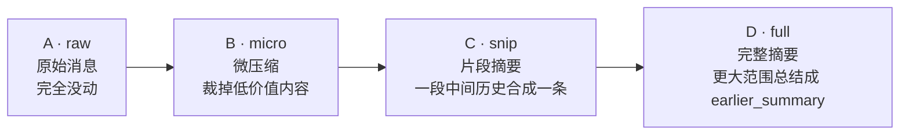
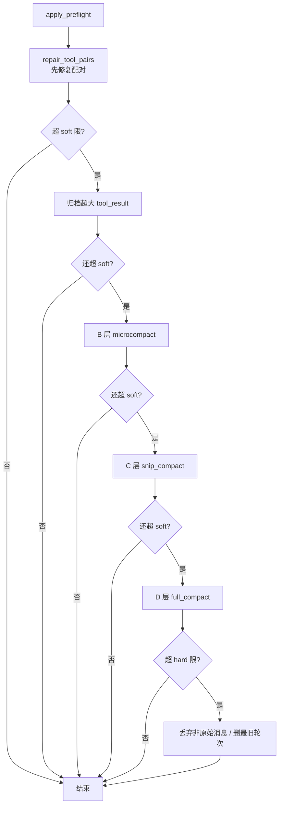
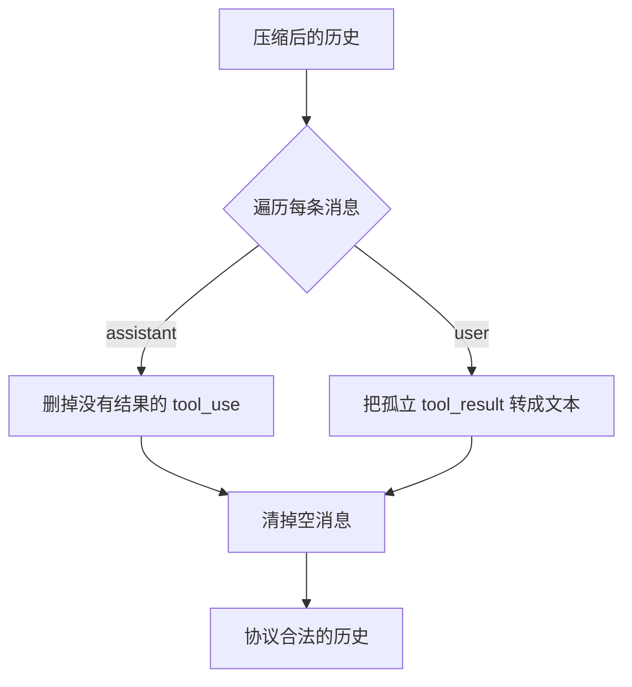
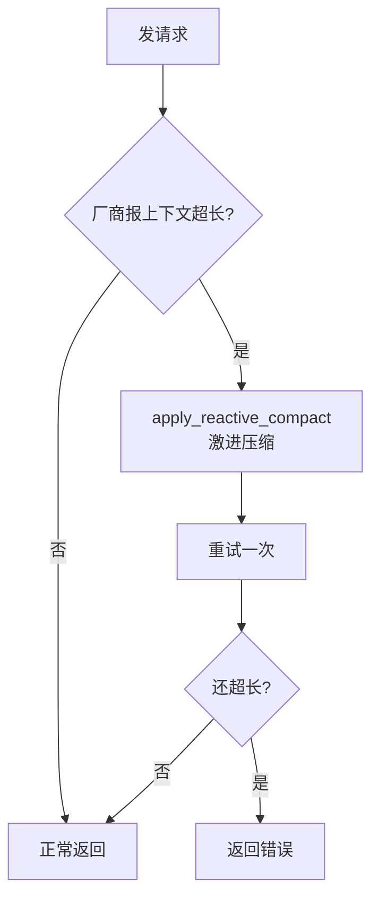

# 第 5 章：上下文压缩

模型的上下文窗口是有限的。任务跑得越久，LLM History 越大；大到超过窗口，请求就会失败。这一章讲 Chrysalis 怎么解决这个问题：在尽量不丢关键信息的前提下，把过长的历史压下去。

相关代码集中在 `chrysalis/llm/context.py`，核心是 `CompactionManager` 类。

## 5.1 问题：长任务会撑爆上下文

想象一个任务："读完 docs 目录下所有文档，逐个总结，最后汇总。" 每读一个文件，历史里就多一条几千字的 `tool_result`。读到第十个文件时，历史可能已经几万 token。再发请求，模型直接报"上下文超长"。

最简单的办法是"删掉旧的"。但粗暴删除有两个问题：

1. **可能删掉关键信息**——比如用户最初的目标、某个关键决策。
2. **可能破坏 tool_use / tool_result 配对**——删了一半配对，请求直接报错（还记得第 3 章的配对铁律吗）。

所以压缩不能是"一刀切删除"，得有策略、分层次、还要修复配对。

## 5.2 核心思想：分四层，越压越狠

Chrysalis 把每条历史消息标记成四个"压缩等级"（`context.py` 顶部的设计）：



| 等级 | 名字 | 做了什么 | 信息损失 |
| --- | --- | --- | --- |
| A | raw | 原始消息，没动过 | 无 |
| B | micro | 裁掉旧 thinking、大图片、超长 tool_result、超长工具参数 | 小 |
| C | snip | 把一段稳定的中间历史合并成一条摘要 | 中 |
| D | full | 把更大范围的历史总结成 `earlier_summary` | 大 |

压缩时**从最轻的 B 开始，不够再上 C，还不够才上 D**。这样优先保住信息——能微调就不大改。

为什么要分级而不是直接总结？还有一个隐藏原因：**prompt 缓存**。厂商会对相同的请求前缀做缓存以省钱省时。如果每次都重写整段历史，缓存全部失效。分级压缩刻意让靠前的历史尽量稳定，保住缓存前缀。

## 5.3 主压缩流程：apply_preflight

每次请求前（第 4 章 `BaseSession.ask()` 的第 ② 步），都会调 `apply_preflight()`（`context.py:173`）。它是一个**逐级递进**的流程——每做一步都重新估算 token，够了就停：



注意两条限：**soft 限**（默认上下文窗口的 70%）和 **hard 限**（默认 90%）。超过 soft 就开始温和压缩；逼近 hard 才动用"丢弃"这种重手段。

还要注意：**第一步永远是 `repair_tool_pairs`**。在做任何压缩之前先确保配对完整，是贯穿全流程的安全习惯。

## 5.4 逐层看：每层到底做什么

### B 层 microcompact：最轻的裁剪

`microcompact_history()`（`context.py:433`）是最 cache 友好的一层——它**不移动、不合并**任何消息，只在原地裁剪每条消息里的"低价值内容"：

- **超长的 `tool_result`**（>200 字符）压成一行摘要；
- **重复的 `tool_result`**（同样内容出现多次）替换成 `[Duplicate tool output...]`；
- **超长的工具参数**（>500 字符）截断；
- **超长的 thinking**（>1200 字符）截断；
- **图片**直接替换成 `[image omitted by microcompact]`——图片最占 token，又通常看一次就够了。

它还会**保护尾部最近的几轮**不动，因为最近的内容往往最重要。

### C 层 snip：合并一段中间历史

如果 micro 还不够，`snip_compact_history()`（`context.py:516`）登场。它把**中间一段**稳定的历史（保护开头 2 条和尾部最近几轮）合并成一条摘要消息。

为什么是"中间"？因为开头有用户的原始目标要留，结尾有最近进展要留，能牺牲的是中间那段"已经做完、不太会再回看"的历史。

### D 层 full：大范围总结

还不够，就上 `full_compact_history()`（`context.py:553`）。它把"最新的 D 摘要之后的那些 C 摘要"再合并成一个新的 `earlier_summary`。

这里有个精妙设计：**它故意不重新总结旧的 D 摘要**。为什么？还是为了 prompt 缓存——旧 D 摘要保持不变，请求前缀就稳定，缓存就有效。它只滚动合并较新的部分。

D 层的摘要可以用两种方式生成：内置的规则式摘要，或者**让模型自己总结**（LLM summary）。后者质量更高，触发逻辑在 `should_try_llm_summary()` / `build_llm_summary_request()`——准备一个特殊请求，让模型把这段历史浓缩成摘要，再塞回去。

### 最后的手段：丢弃

如果总结完还超 hard 限，只能丢了：

- `drop_non_a_messages()`（`context.py:582`）**一次性**移除所有已压缩的 B/C/D 消息（而不是逐条剥，避免每次都改变缓存前缀）；
- `drop_oldest_turn()`（`context.py:612`）删最旧的完整一轮对话。

这是兜底，正常任务很少走到这一步。

## 5.5 守护配对：repair_tool_pairs

压缩很容易把配对搞断：删了一条 assistant 的 `tool_use`，但它的 `tool_result` 还在；或者反过来。`repair_tool_pairs()`（`context.py:635`）专门修这个：

- **assistant 消息**：如果某个 `tool_use` 在下一条 user 消息里找不到对应的 `tool_result`，就把这个 `tool_use` 删掉；
- **user 消息**：如果有个 `tool_result` 找不到对应的 `tool_use`，就把它转成一段普通文本（`[orphaned tool result converted to text]`），而不是直接删——保住信息又不破坏协议；
- 最后清掉空消息。



它和第 4 章的 `_sanitize_tool_pairs()` 是**两道配套防线**：`repair_tool_pairs` 在 canonical 层修，`_sanitize_tool_pairs` 在翻译成 OpenAI 协议时再兜一次底。双保险确保发出去的请求一定合法。

## 5.6 兜底的兜底：reactive compact

`apply_preflight` 是"请求前"的预防性压缩。但万一估算不准，请求发出去厂商还是报"上下文超长"怎么办？

`BaseSession.ask()` 里有个 `_ask_with_reactive_retry`：捕获到上下文超限错误后，调用更激进的 `apply_reactive_compact()`（`context.py:304`），压得比 preflight 狠得多（保留更少轮次、更小目标），然后**重试一次**。你会看到这样一条提示：

```text
[Chrysalis] 上下文过长，已自动压缩历史并重试一次。
```

它在压缩前还会先 `save_transcript` 把完整历史存盘，以免激进压缩丢了东西没法追溯。



## 5.7 压缩想保住的三类信息

回到出发点：压缩的目标不是"越短越好"，而是**用尽量少的 token 保住最重要的东西**。具体说，它优先保住三类信息：

1. **用户的目标和关键决策**——开头的用户消息和重要节点。
2. **可追溯的事实**——文件路径、命令、错误信息、关键工具结果。
3. **协议合法性**——tool_use / tool_result 的配对结构。

理解了这三条，你就明白为什么压缩要分层、要保护头尾、要反复修复配对——每个设计都在服务"保住关键信息"这个目标。

## 5.8 token 是怎么估算的

每一步压缩都要判断"现在多少 token"。估算在 `estimate_context_tokens`（`context.py:1079`）：优先用 `tiktoken` 精确编码；如果没装 tiktoken，就退化成"字符数 ÷ 4"的粗略估计。图片固定按约 1200 token 算。这个估算不需要精确，够用来决定"要不要继续压"就行。

## 5.9 动手练习

### 练习 A：触发一次压缩

把 `.env` 里的 `CHRYSALIS_CONTEXT_WINDOW` 调小（比如 `8000`），然后跑一个会读多个文件的任务：

```bash
chrysalis "逐个读取 docs/tutorial 下的所有 md 文件并分别总结"
```

任务结束后看返回 JSON 的 `context` 字段，观察压缩是否触发。记得测完改回去。

### 练习 B：在会话文件里找压缩痕迹

跑完上面的任务，打开会话文件，搜索 `earlier_summary` 或 `_compact_level`。找到被压缩的消息，对照 5.4 节判断它被压到了哪一层。

### 练习 C：读懂分级的意义

打开 `context.py`，找到 `apply_preflight()`。数一数它一共有几个"判断 token 是否还超限"的检查点。想清楚：为什么不一次性做完所有压缩，而要每做一步就重新判断？（提示：和"保住信息"与"prompt 缓存"都有关。）

---

模型层到此结束。下一章进入行动层：模型说"我要调 file_read"，这个工具调用具体是怎么被执行的？工具又是怎么注册的？

→ [第 6 章：工具调用](/tutorial/tools)
