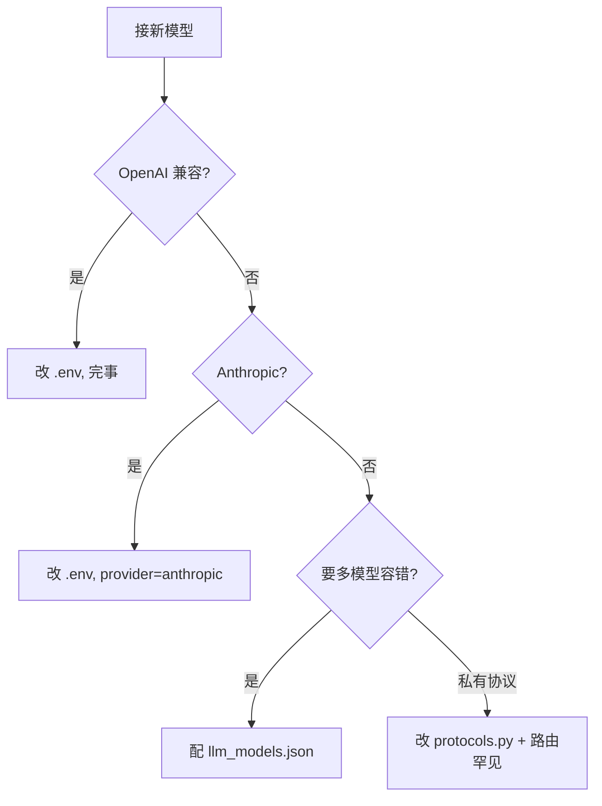

# 第 12 章：动手扩展 Chrysalis

读完前 11 章，你已经理解了 Chrysalis 的每个子系统。这一章把知识用起来——动手做三件最常见的扩展：**加一个工具、加一个交互命令、接一个新模型**。每件事都会用到前面的章节，算是一次全书复习。

## 12.1 加一个工具

这是最常见的扩展。回忆第 6 章：工具靠 `@tool` 注册，靠 `tools/__init__.py` 导入才生效。我们加一个 `project_info` 工具，返回项目根目录和工作区路径。

### 第 1 步：写工具函数

在 `chrysalis/tools/` 下新建 `info_tools.py`（或加到现有模块里）：

```python
from pathlib import Path
from chrysalis.tools.registry import tool

@tool("project_info", "返回项目根目录和当前工作区路径", params={})
def project_info(args: dict, workspace: Path | None = None) -> dict:
    from configs.config import PROJECT_ROOT
    return {
        "ok": True,
        "project_root": str(PROJECT_ROOT),
        "workspace": str(workspace) if workspace else "",
    }
```

注意三点，都来自第 6 章：

- 函数签名固定 `(args: dict, workspace=None) -> dict`。
- 返回 dict 至少带 `ok`。
- 这是个只读工具，没有副作用——最容易上手。

### 第 2 步：导入模块（最容易漏的一步）

在 `chrysalis/tools/__init__.py` 里加一行 import：

```python
import chrysalis.tools.info_tools     # ← 加这行
```

第 6 章 6.3 节强调过：`@tool` 只在模块被导入时才注册。漏了这步，模型永远看不到你的工具。

### 第 3 步：验证

```python
from chrysalis.tools.registry import get_registry
print("project_info" in get_registry())   # 应该是 True
```

然后跑一个任务让模型用它：

```bash
chrysalis "用 project_info 告诉我项目根目录在哪"
```

### 如果工具会改文件或有副作用

上面是只读工具。如果你的工具要：

- **写文件**：用 `safe_path()` 解析路径（第 6 章 6.8 节），别自己拼 `Path(args["path"])`，否则绕过了安全检查。
- **改 Working Memory**：别直接改，而是返回 `_todo` / `_checkpoint` / `_long_term` 标记，让 `AgentLoop` 处理（第 2 章 2.6 节的设计模式）。
- **需要用户介入**：返回 `{"ok": False, "need_user": True, "question": "..."}`。
- **属于高风险动作**：去 `permission.py` 补一条权限策略（第 7 章），否则它的风险边界可能不符合预期。

### 新增工具 checklist

| 步骤 | 做什么 | 对应章节 |
| --- | --- | --- |
| 1 | 用 `@tool(name, desc, params)` 写函数 | 第 6 章 |
| 2 | 签名保持 `(args, workspace) -> dict` | 第 6 章 |
| 3 | 涉及路径用 `safe_path()` | 第 6 章 |
| 4 | 参数自己做类型转换（schema 全是 string） | 第 6 章 |
| 5 | 返回 dict 至少含 `ok` | 第 6 章 |
| 6 | 在 `tools/__init__.py` 导入模块 | 第 6 章 |
| 7 | 高风险动作去 `permission.py` 补策略 | 第 7 章 |
| 8 | 跑个最小任务验证模型能调用 | — |

最容易漏的是第 6 步和第 7 步。

## 12.2 加一个交互命令

回忆第 2 章 2.1 节：交互模式（`chrysalis --interactive`）里那些 `/session`、`/queue`、`/cron` 命令，都在 `run_interactive()`（`kernel.py:322`）里处理。我们加一个 `/usage` 命令，显示当前会话的 token 用量。

### 命令是怎么分发的

`run_interactive()` 读到输入后，先判断是不是命令。命令集合定义在 `kernel.py` 顶部：

```python
EXIT_COMMANDS = {"/exit", "/quit", "exit", "quit", "退出", "再见"}
SESSION_COMMANDS = {"/session", "/sessions", "/s"}
QUEUE_COMMANDS = {"/queue", "/q"}
PERMISSION_COMMANDS = {"/permissions", "/permission", "/perm"}
# ...
```

然后用 `cmd_word = task.split()[0].lower()` 取首词，匹配到哪个集合就调对应的 `_handle_xxx_command`。

### 加 /usage

在命令集合区加一个：

```python
USAGE_COMMANDS = {"/usage", "/u"}
```

在 `run_interactive()` 的命令分发链里加一个分支（参照已有的 `/permissions` 写法）：

```python
if cmd_word in USAGE_COMMANDS:
    print(kernel.tracker.format_session_summary())
    continue
```

`kernel.tracker` 就是第 2 章 ② 号角色 `UsageTracker`（第 4 章 4.7 节讲过它分三级累计）。`format_session_summary()` 是它现成的方法。

这个例子很小，但它展示了扩展交互层的套路：**定义命令集合 → 在分发链里加分支 → 调 Kernel 已有的能力**。复杂命令（带子命令、带参数）可以参照 `_handle_session_command` / `_handle_cron_command` 的写法。

## 12.3 接一个新模型提供商

回忆第 4 章：模型协议的差异被隔离在 `protocols.py`，配置在 `LLMConfig`。接一个 OpenAI 兼容的新服务，通常**根本不用改代码**，只改配置。

### 情况一：OpenAI 兼容服务（最常见）

绝大多数国产模型服务都兼容 OpenAI 协议。直接配 `.env`：

```text
CHRYSALIS_LLM_PROVIDER=openai
CHRYSALIS_API_KEY=sk-xxx
CHRYSALIS_BASE_URL=https://your-service.com/v1
CHRYSALIS_MODEL=your-model-name
```

`provider` 不是 `anthropic`，就走 OpenAI 协议（第 4 章 4.4 节的路由）。这就够了——`to_openai_messages` 会处理好一切。

### 情况二：Anthropic 协议

```text
CHRYSALIS_LLM_PROVIDER=anthropic
CHRYSALIS_API_KEY=sk-ant-xxx
CHRYSALIS_MODEL=claude-opus-4-8
```

`provider` 是 `anthropic`/`claude` 就走 `to_anthropic_messages`。注意第 4 章讲过：Anthropic 协议会保留 thinking 块，OpenAI 不会。

### 情况三：多模型 Failover

想配主备模型自动切换？用 `configs/llm_models.json`（一个数组）：

```json
[
  {"provider": "openai", "api_key": "${KEY_A}", "base_url": "...", "model": "model-a"},
  {"provider": "anthropic", "api_key": "${KEY_B}", "model": "claude-opus-4-8"}
]
```

回忆第 4 章 4.6 节：`create_client()` 看到多个配置，就创建 `FailoverSession`。主模型挂了自动切备用，300 秒后还会试着切回主模型。`${KEY_A}` 这种写法会从环境变量展开。

### 情况四：真要改协议（罕见）

如果新服务的协议既不是 OpenAI 也不是 Anthropic（比如某种私有格式），才需要动代码。这时你要：

1. 在 `protocols.py` 写一个新的 `to_xxx_messages()` 翻译函数；
2. 在 `session.py` 的 `_raw_ask_with_options()` 里加一条协议路由分支；
3. 实现对应的 stream 函数。

但说实话，99% 的情况都落在情况一到三，改配置就行。这正是第 4 章那个适配层设计的价值——**新增模型，上层一行不用动**。



## 12.4 扩展时的几条原则

把全书的设计哲学浓缩成几条，扩展时记住它们：

1. **顺着已有模式走。** 加工具就照现有工具的样子写，加命令就照现有命令的样子写。Chrysalis 的一致性很强，模仿现有代码通常就对了。
2. **状态变更走 AgentLoop。** 工具别自己改全局状态，返回意图标记，让 AgentLoop 统一处理（第 2、6 章）。
3. **涉及文件先过 `safe_path`。** 别绕过安全层（第 6 章）。
4. **高风险动作配权限。** 新增能改变本机状态的工具，记得在 `permission.py` 补策略（第 7 章）。
5. **改完跑测试。** 项目有 pytest，改完核心逻辑跑一下：`pip install -e ".[dev]"` 然后 `pytest`。改了文档跑 `npm run docs:build`。

## 12.5 综合练习

### 练习 A：做完 project_info

把 12.1 节的 `project_info` 工具真正实现一遍，从写函数到验证模型能调用。这是检验你理解第 6 章的最好方式。

### 练习 B：加一个有副作用的工具

挑战升级：加一个 `note_append` 工具，把一条备注追加到 `workspace/notes.md`。要求用 `safe_path()` 解析路径。然后想想——它在 `balanced` 权限下会触发确认吗？为什么？（对照第 7 章 `file_write` 的风险判定。）

### 练习 C：读懂一条现有命令

打开 `kernel.py`，完整读一遍 `_handle_session_command()`。它支持 `new`、`load`、`delete` 等子命令。试着照它的结构，设计（不必实现）一个 `/export` 命令，把当前会话导出成 Markdown。你需要用到哪些已有的能力？（提示：`session_store` 和第 3 章的会话结构。）

## 结语

到这里，这本教程就结束了。回头看，你已经走过了：

- **入门**：Agent 是什么、Kernel 怎么装配、循环怎么转（第 1~2 章）
- **模型层**：历史怎么存、协议怎么适配、长了怎么压（第 3~5 章）
- **行动层**：工具怎么调、权限怎么把关（第 6~7 章）
- **记忆层**：工作记忆、长期记忆、技能库（第 8~10 章）
- **进阶**：子 Agent、网关、桌面端、动手扩展（第 11~12 章）

Chrysalis 不大，但五脏俱全——它把一个真正可用的本地 Agent 需要的所有基础设施，都用尽量清晰的方式实现了一遍。最好的继续学习方式，就是真的去改它：加个工具、调个策略、接个模型，看看会发生什么。

祝你玩得开心。如果你做出了有意思的扩展，欢迎到 [GitHub](https://github.com/hsdaoqi/Chrysalis-Agent) 分享。

---

← 回到 [第 1 章：Agent 是什么](/tutorial/overview) ｜ [文档首页](/)
