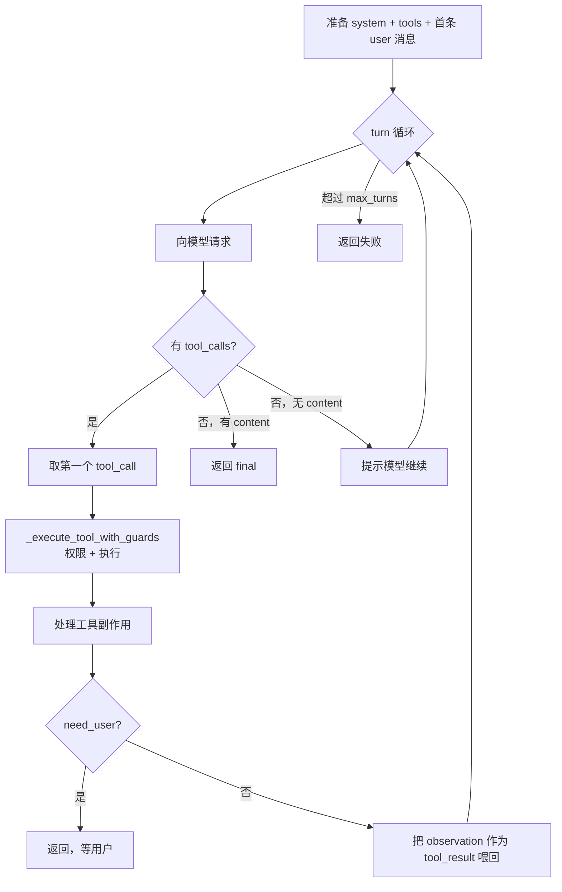
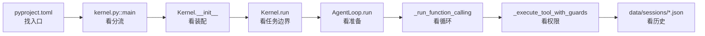

# 第 2 章：Kernel 装配与观察-行动循环

上一章我们建立了全局观：一次任务由五个角色协作完成。这一章我们打开两个最核心的文件——`chrysalis/kernel.py` 和 `chrysalis/agent_loop.py`——看它们到底怎么写的。

读完本章，你应该能回答：命令是怎么进入 Python 的？Kernel 装配了什么？那个观察-行动循环的代码长什么样？

## 2.1 命令是怎么进入 Python 的

当你在终端敲 `chrysalis "..."`，操作系统是怎么知道要运行哪段 Python 的？答案在 `pyproject.toml`：

```toml
[project.scripts]
chrysalis = "chrysalis.kernel:main"
chrysalis-gateway = "chrysalis.gateway.main:main"
```

`pip install -e .` 时，这段配置会在你的环境里注册两个命令行入口。`chrysalis` 这个命令最终指向 `chrysalis/kernel.py` 里的 `main()` 函数。所以一切的起点就是 `main()`。

### main() 是一个"分流器"

`main()`（`kernel.py:278`）本身不干活，它只判断你想进入哪种模式，然后分流。它的判断顺序有点讲究——**不是全靠 argparse**，而是先做几个手工检查：

```python
def main() -> None:
    # 1. connect / /connect —— 在 argparse 之前就拦截
    if len(sys.argv) > 1 and sys.argv[1].lower() in CONNECT_COMMANDS:
        run_connect_cli(sys.argv[2:])
        return

    # 2. -h / --help —— 手动处理，不交给 argparse
    if any(arg in {"-h", "--help"} for arg in sys.argv[1:]):
        print(HELP_TEXT)
        return

    # 3. 其余交给 argparse
    parser = argparse.ArgumentParser(add_help=False)
    parser.add_argument("-i", "--interactive", action="store_true", ...)
    parser.add_argument("--tui", action="store_true", ...)
    parser.add_argument("--quiet", action="store_true", ...)
    parser.add_argument("task", nargs="*", ...)
    args = parser.parse_args()
```

解析完参数后，又是一串分支：

```mermaid
flowchart TB
  Start[main] --> C1{argv[1] 是 connect?}
  C1 -->|是| Connect[run_connect_cli]
  C1 -->|否| C2{有 -h/--help?}
  C2 -->|是| Help[打印 HELP_TEXT]
  C2 -->|否| Parse[argparse 解析]
  Parse --> C3{--tui?}
  C3 -->|是| Tui[launch_tui]
  C3 -->|否| C4{task 首词是 cron?}
  C4 -->|是| Cron[_handle_cron_command]
  C4 -->|否| C5{--interactive?}
  C5 -->|是| Inter[run_interactive]
  C5 -->|否| C6{task 为空?}
  C6 -->|是| Err[报用法错误退出]
  C6 -->|否| Single[Kernel.run 单次任务]
```

关键认知：**CLI、交互模式、TUI 不是三套独立的 Agent，它们只是进入同一个 `Kernel` 的不同门。** 单次任务和交互模式都会构造一个 `Kernel` 再调用它；TUI 和网关也一样在内部用 `Kernel`。这就是"一套内核，多个入口"在代码层面的含义。

`--quiet` 控制的是 `progress` 回调：安静模式下 `progress=None`，否则用 `stderr_progress`，把每轮进度打到标准错误流。

## 2.2 Kernel 装配了什么

进入单次任务分支时，代码是这样的（`kernel.py:314`）：

```python
result = Kernel(progress=progress).run(task)
print(json.dumps(result, ensure_ascii=False, indent=2, default=str))
```

构造一个 `Kernel`，调它的 `run()`，把结果打成 JSON。所以真正的装配发生在 `Kernel.__init__()`（`kernel.py:55`）。我们逐个看它创建了什么——这正是上一章练习 C 的答案：

```python
def __init__(self, config=None, llm=None, progress=None, session_id=None):
    self.config = config or AgentConfig()                              # ① 配置
    self.progress = progress
    self.session_store = SessionStore(self.config.data_dir / "sessions")  # ② 会话存储
    self.tracker = UsageTracker(                                        # ③ 用量统计
        persist_path=self.config.data_dir / "usage_history.jsonl",
        pricing=self.config.llm.pricing_dict(),
    )
    self.llm = llm or create_client(                                   # ④ 模型客户端
        self.config.load_session_configs(),
        tracker=self.tracker,
        on_history_changed=self.session_store.save,
    )
    self.pending_user_action: dict | None = None
    self.history: list[str] = []
    self.loop = AgentLoop(                                             # ⑤ 观察-行动循环
        self.llm, self.config.workspace_dir, self.config.max_turns,
        progress=self.progress, history=self.history,
        permission_engine=self._create_permission_engine(),           # ⑥ 权限引擎
    )
    self.permission_engine = self.loop.permission_engine
    self.hooks = self.loop.hooks
    if session_id:
        self.load_session(session_id)
    else:
        self.session_store.new_session(model=self.active_model_name)
```

把它对应到上一章的五个角色：

| 行 | 创建的对象 | 角色 | 干什么 |
| --- | --- | --- | --- |
| ① | `AgentConfig()` | 配置 | 读 `.env`、运行目录、权限等级、`max_turns` |
| ② | `SessionStore(...)` | 会话存储 | 管 `data/sessions/*.json` |
| ③ | `UsageTracker(...)` | 用量统计 | 记 token、turn、耗时、费用 |
| ④ | `create_client(...)` | LLMClient | 单模型或多模型 Failover 客户端 |
| ⑤ | `AgentLoop(...)` | 观察-行动循环 | 真正跑任务 |
| ⑥ | `_create_permission_engine()` | 权限引擎 | 决定工具是否需要确认 |

有两个细节值得停下来想一想。

**细节一：`on_history_changed=self.session_store.save`。** 创建模型客户端时，把"会话存储的保存方法"作为回调传了进去。这意味着：每当模型历史发生变化，会自动触发保存。会话持久化不是某个地方手动调用的，而是用**回调**挂在了历史变更上。这是个很优雅的解耦——AgentLoop 完全不需要知道"会话要存到哪"。

**细节二：权限引擎是装出来的。** 看 `_create_permission_engine()`（`kernel.py:98`）：

```python
def _create_permission_engine(self):
    if self.permission_level.lower() in {"full", "trusted", "off", "none"}:
        return FullAccessPermissionEngine()
    return PermissionEngine(level=..., store_path=self.config.permissions_json)
```

如果权限等级是"完全信任"，就用一个永远放行的 `FullAccessPermissionEngine`；否则用真正会判断的 `PermissionEngine`。权限策略在装配阶段就定下来了，AgentLoop 拿到的是一个已经配好的引擎。权限的细节我们留到 [第 7 章](/tutorial/permission)。

::: tip Kernel 不干活
注意 `Kernel.__init__()` 里没有任何"调用模型""执行工具"的逻辑。它纯粹在装配。这是一种刻意的设计：把"准备运行时"和"运行"分开。想改入口行为、改返回的 JSON 字段，看 Kernel；想改 Agent 怎么行动，看 AgentLoop。
:::

## 2.3 Kernel.run：一次任务的边界

`Kernel.run()`（`kernel.py:111`）是"任务级"的包装层。它本身不跑循环，而是管一次任务的开始、恢复、统计和收尾：

```python
def run(self, task, session_context="", images=None) -> dict:
    started = time.perf_counter()
    self.llm.reset_task_usage()                                  # 重置本次 usage
    run_task, extra_context, immediate = self._resolve_pending_user_action(task)
    if immediate is not None:
        return immediate                                         # 提前返回（如权限详情）
    merged_context = "\n\n".join(p for p in (session_context, extra_context) if p)
    result = self.loop.run(run_task, session_context=merged_context, images=images, ...)
    if result.get("need_user"):
        self.pending_user_action = {...}                         # 记下"在等用户"
    result["elapsed_ms"] = _elapsed_ms(started)
    self.tracker.end_task(run_task[:100], elapsed, model)
    result["usage"] = self.tracker.task_usage_dict()
    result["context"] = self.llm.context_usage()                 # 附上上下文占用
    self._capture_memory_review(run_task, result)
    return result
```

它做了五件事：重置用量 → 处理"上一轮在等用户"的情况 → 调 `AgentLoop.run()` 真正执行 → 给结果附上耗时/usage/context → 触发记忆审查。

这里要区分两个容易混的概念：

| 概念 | 含义 | 谁管 |
| --- | --- | --- |
| 一次**任务** | 用户给一个目标，Agent 跑到 final 或中断 | `Kernel.run()` |
| 一个**会话** | 多次任务共享同一份 LLM history | `SessionStore` |

### `_resolve_pending_user_action`：任务的"断点续传"

`run()` 里那行 `_resolve_pending_user_action(task)` 处理一个很实际的问题：**上一次任务中途停下来等你操作了，这次你回话了，怎么续上？**

比如 Agent 要访问一个需要登录的网页，它会停下来返回"请你在浏览器里登录"。这时任务并没结束，而是 `pending_user_action` 被记了下来。你登录完，输入"已完成"，下一次 `run()` 就要判断："这句'已完成'不是新任务，而是对上次中断的回应。"

`_resolve_pending_user_action`（`kernel.py:194`）正是干这个的。它返回一个三元组 `(run_task, extra_context, immediate)`，根据上次中断的类型和你这次的输入分流：

- 上次是**权限请求**，这次你说"允许" → 清掉 pending，把原任务接着跑。
- 上次是**权限请求**，这次你说"拒绝" → 把"用户拒绝了，请换方案"作为额外上下文交回。
- 你这次说的话命中"已完成/已登录/继续"等词（`USER_ACTION_DONE_WORDS`）→ 上下文变成"用户已完成操作，请从当前状态继续"。
- 你说"跳过/换方案"等词（`USER_ACTION_SKIP_WORDS`）→ 上下文变成"用户选择跳过，请改用其他方案"。
- 其余情况 → 当作你在回答上次 `ask_user` 的提问。

这套机制让 Agent 能跨多次命令"接着干"，而不是每次都从零开始。

## 2.4 观察-行动循环：AgentLoop.run

现在进入全项目最核心的代码：`chrysalis/agent_loop.py`。

`AgentLoop.run()`（`agent_loop.py:77`）开头先做任务级准备：

```python
def run(self, task, session_context="", ...):
    self._cancel_event.clear()
    self.working.reset()                                      # 清空工作记忆
    self._tool_trace = []                                     # 清空工具轨迹
    self.history_info.append(f"[USER]: {brief_text(task, 400)}")
    # 任务级权限判断
    permission = self.permission_engine.assess_task(task, session_context=session_context)
    if permission.denied:
        return ...                                            # 危险任务直接拦
    # 组装上下文
    assembled = self.context_engine.assemble(
        base_system=system_prompt, task=task, working=self.working,
        history_lines=self.history_info, session_context=session_context, ...)
    # 进入循环
    if self.use_function_calling:
        result = self._run_function_calling(assembled.system, task, ...)
    else:
        result = self._run_json_in_text(...)
    # 任务成功后：判断要不要沉淀记忆/技能
    if result.get("ok"):
        memory_decision = self._judge_memory(...)
        artifact = self._maybe_create_skill_draft(..., memory_decision)
    return result
```

注意三件事：

1. **每次任务开始都 `self.working.reset()`。** Working Memory 是"单次任务级"的——它记录的是这一次任务做到哪了，任务一结束就清空。这和长期记忆（跨任务）是两回事，[第 8 章](/tutorial/working-memory) 详谈。
2. **`assess_task` 在循环之前。** 如果任务本身一看就危险（比如"删除整个磁盘"），在这里就被拦了，根本不会进循环。这是权限的第一道关，第二道关在每个工具执行前。
3. **任务成功后才考虑沉淀。** `_judge_memory` 和 `_maybe_create_skill_draft` 只在 `result["ok"]` 为真时调用——失败的任务不值得沉淀经验。

### 循环的主体：_run_function_calling

真正的循环在 `_run_function_calling()`（`agent_loop.py:186`）。先把系统提示词和工具 schema 交给模型，然后开一个 turn 循环：

```python
tools = self.tools_schema or TOOLS_SCHEMA
self.llm.set_system(system)
self.llm.set_tools(tools)
messages = [{"role": "user", "content": task, "images": ..., "meta": ...}]

for turn in range(1, self.max_turns + 1):
    response = _exhaust_generator(_chat_with_optional_turn(self.llm, messages, tools=tools, ...))

    if response.tool_calls:                          # 模型要调工具
        tc = response.tool_calls[0]                  # 只取第一个！
        args = json.loads(tc.arguments)              # 解析参数
        observation = self._execute_tool_with_guards(tc.name, args, ...)
        self._handle_agent_tool_side_effects(observation)
        compact = compact_observation(observation)

        if observation.get("need_user"):             # 工具要求用户介入
            return {... "need_user": True ...}

        obs_text = dumps_observation(compact)
        messages = [{"role": "user",
                     "content": self._next_prompt_with_anchor(obs_text),
                     "tool_results": [{"tool_use_id": tc.id, "content": obs_text}]}]
        continue                                     # 进入下一轮

    if response.content:                             # 模型给出最终回答
        return {"ok": True, "final": response.content, "agent_turns": turn}

# 转满 max_turns 还没结束
return {"ok": False, "final": "达到最大轮数，仍未得到最终回答。"}
```

把它画成流程图，就是第 1 章那个循环的真身：



这里有几个**真实代码里才看得到的细节**，值得专门点出来：

- **每轮只处理一个工具调用**（`response.tool_calls[0]`）。即使模型一次返回多个 tool_call，Chrysalis 当前也只执行第一个，其余忽略。这是有意的简化——保证每一步都可控、可追踪。
- **`max_turns` 是安全阀。** 默认值由 `AgentConfig.max_turns` 给出，是 **70**（注意 `AgentLoop.__init__` 自己的默认参数是 12，但实际运行时 Kernel 传的是配置里的 70）。转满还没出 final 就强制结束，防止模型陷入死循环烧 token。
- **工具结果要"喂回"成 `tool_result`。** 下一轮的 user 消息带着 `tool_results=[{"tool_use_id": tc.id, "content": obs_text}]`，`tool_use_id` 必须和模型发起调用时的 id 对上——这是模型协议的硬性要求，[第 4 章](/tutorial/llm-protocol) 会讲为什么。

## 2.5 工具执行前的安全闸门

循环里那行 `self._execute_tool_with_guards(...)` 不是直接跑工具，而是先过权限。看 `_execute_tool_with_guards()`（`agent_loop.py:563`）的骨架：

```python
def _execute_tool_with_guards(self, tool_name, args, ...):
    permission = self.permission_engine.assess_tool(tool_name, args, workspace=..., ...)
    if permission.needs_user:
        resolved = self._resolve_permission_request(request)
        if resolved action == "allow":
            permission = self.permission_engine.assess_tool(..., session_context=resolved["context"])
        elif action == "deny":
            return {"ok": False, "blocked": True, "error": "用户拒绝了权限请求"}
        ...
    if permission.denied:
        return {... "blocked": True ...}
    # 只有过了权限，才真正执行
    observation = run_tool(tool_name, args, self.workspace)
    return observation
```

核心就一句话：**模型可以提出调用任何工具，但工具不会立刻执行——必须先过 `assess_tool`。** 只读操作（如读普通文件）通常直接放行；写文件、跑脚本等会返回 `needs_user`，于是循环停下来，把权限请求交给界面（TUI 弹窗 / CLI 等你输入）。这就是 Agent"会动但不失控"的关键。

`run_tool`（来自 `chrysalis/tools/registry.py`）会按工具名找到被 `@tool` 注册的函数去执行。这部分是 [第 6 章](/tutorial/tools) 的主题。

## 2.6 工具结果如何改写工作记忆

执行完工具，循环里还有一行 `self._handle_agent_tool_side_effects(observation)`。这处理一类特殊工具——它们不产出数据，而是**想改变 Agent 的状态**。

看 `_handle_agent_tool_side_effects()`（`agent_loop.py:452`）：

```python
def _handle_agent_tool_side_effects(self, observation):
    if observation.get("_todo"):
        self.working.update_todos(observation["todos"], ...)
    if observation.get("_plan"):
        self.working.update_plan(...)
    self.working.tick_round()
    if observation.get("_checkpoint"):
        self.working.update_checkpoint(...)
    if observation.get("_long_term"):
        self.working.request_long_term_update(...)
```

这里藏着一个很值得学习的设计模式：

> 像 `todo_write`、`update_working_checkpoint` 这些工具，**自己并不修改任何状态**。它们只是在返回值里放一个标记（`_todo`、`_checkpoint`……表示"我想更新 TODO/检查点"）。真正修改 `WorkingMemory` 的地方统一在 `AgentLoop`。

为什么要这样绕一圈？因为这样一来：工具函数保持简单（只返回意图），状态变更集中在一处（方便统一控制和通知 UI）。CLI、TUI、桌面端都能通过同一个回调收到"TODO 变了"的通知，而不用各自去猜。

## 2.7 任务收尾：保存与沉淀

模型给出最终回答后，`_run_function_calling` 返回 `{"ok": True, "final": ...}`。接下来：

1. **保存会话**：还记得 2.2 节那个 `on_history_changed` 回调吗？模型历史变化时它已经触发了 `SessionStore.save()`，会话被写进 `data/sessions/`。
2. **统计用量**：`Kernel.run()` 给结果附上 `usage` 和 `context`。
3. **尝试沉淀技能**：`_maybe_create_skill_draft()`（`agent_loop.py:510`）调用 `SkillCurator.maybe_create_draft()`，把这次成功任务的轨迹交给它判断要不要生成一个"技能草稿"。注意草稿不会自动生效，需要人工审核晋升——细节在 [第 10 章](/tutorial/skills)。

这就是一次任务从入口到收尾的完整代码路径。

## 2.8 源码阅读路线

如果你想亲手把这章过一遍，建议按"跑一个任务，再追踪它"的方式读，而不是从文件顶部硬啃：



## 2.9 动手练习

### 练习 A：找到循环的退出条件

打开 `agent_loop.py`，找到 `_run_function_calling()`。它有**三种**退出方式：返回 final、返回 need_user、转满 max_turns。在代码里把这三个 `return` 都找出来，确认你理解了各自的触发条件。

### 练习 B：观察 max_turns

把 `.env` 里加一行 `CHRYSALIS_MAX_TURNS=3`，然后给一个需要多步的任务：

```bash
chrysalis "读取 docs 目录下所有 md 文件，逐个总结，最后汇总"
```

如果任务在 3 轮内没做完，你会看到"达到最大轮数"的结果。这让你直观感受到 `max_turns` 这个安全阀的作用。记得测完把它改回去（或删掉）。

### 练习 C：追踪一个写文件任务的权限

```bash
chrysalis "在 workspace/test.txt 写入一行 hello"
```

在 `balanced` 权限下它会停下来请求确认。对照 2.5 节，想清楚：这个"停下来"发生在 `_run_function_calling` 的哪一行？`need_user` 这个标记是从哪里冒出来的？

---

下一章进入模型层：会话历史到底以什么格式保存？为什么需要一份"统一格式"的历史？

→ [第 3 章：LLM History 与会话存储](/tutorial/llm-history)
