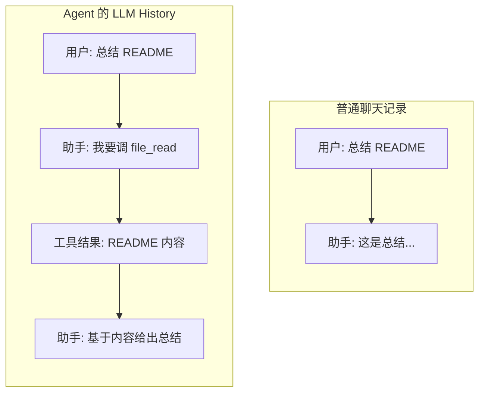
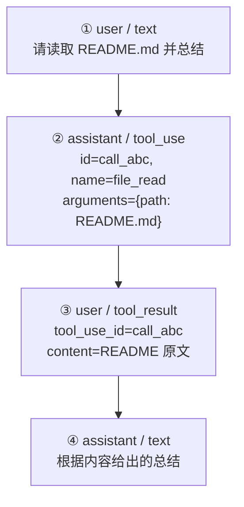
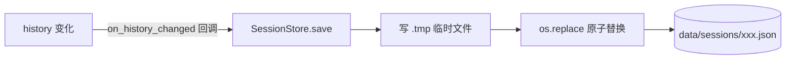

# 第 3 章：LLM History 与会话存储

第 2 章我们看到，AgentLoop 每跑一步都会往模型历史里追加内容。这一章专门讲这份历史：它记录了什么、存在哪、怎么读懂它、加载旧会话时又发生了什么。

::: tip 和第 4 章的分工
这一章关注**历史是什么、存在哪**；下一章 [LLM 协议适配层](/tutorial/llm-protocol) 关注**历史用什么格式、怎么翻译给模型**。两章配合着读，模型层就通了。canonical history 的数据结构这里只简单带过，详细定义在第 4 章。
:::

## 3.1 Agent 的"行车记录仪"

普通聊天记录只记问答两行；而 Agent 的历史要记录完整的行动轨迹。还是用读 README 的例子对比：



这份完整轨迹叫 **LLM History**。它是 Chrysalis 几乎所有能力的底座：

- **会话回放** —— 你能在 TUI / 桌面端看到每一轮做了什么。
- **任务恢复** —— 加载旧会话，Agent 知道之前干到哪了。
- **上下文压缩** —— 压缩的就是这份历史（第 5 章）。
- **经验沉淀** —— 技能草稿从这份轨迹里提炼（第 10 章）。

## 3.2 历史里到底有什么

LLM History 是一个消息列表，每条消息有 `role` 和 `blocks`。一次"读文件"任务会留下四条消息：



这四条加起来，才是完整的一次工具任务。注意第 ③ 条：**工具结果的 role 是 `user`**。这不是说真人手写了结果，而是 canonical 格式约定"工具结果作为下一轮输入交回模型"，所以归在 user 侧。各种 block 类型的详细结构见 [第 4 章 4.2 节](/tutorial/llm-protocol#_4-2-canonical-history-长什么样)。

### 一个铁律：tool_use 和 tool_result 必须配对

第 2 章和第 4 章都提到过，这里强调一遍，因为它是很多诡异 bug 的根源：

> 模型发起的每个 `tool_use`，**必须**有一个 `tool_use_id` 对得上的 `tool_result`。只剩 `tool_use` 没有结果，或者有孤立的 `tool_result`，厂商 API 都可能直接报错。

这就是为什么压缩历史时有 `repair_tool_pairs()`（第 5 章）、翻译协议时有 `_sanitize_tool_pairs()`（第 4 章）——它们都在守护这条配对铁律。也是为什么**不建议手动编辑会话文件**：你很容易不小心删掉一半配对。

## 3.3 会话存进了哪里

历史保存在 `data/sessions/{session_id}.json`，由 `SessionStore`（`chrysalis/session_store.py`）管理。回忆第 2 章那个 `on_history_changed` 回调：每当历史变化，就自动触发 `SessionStore.save()`。

看 `save()`（`session_store.py:76`）写进文件的结构：

```python
data = {
    "id": self._current_id,
    "title": existing.get("custom_title") or _extract_title(history),  # 默认取首条用户消息
    "custom_title": existing.get("custom_title", ""),                   # 用户自定义标题
    "pinned": bool(existing.get("pinned", False)),                      # 是否置顶
    "created_at": self._get_created_at(),
    "updated_at": datetime.now().isoformat(timespec="seconds"),
    "model": self._model,
    "turns": _count_user_turns(history),                                # 用户轮数
    "history": history,                                                 # ← 核心：完整 canonical history
}
```

几个设计细节：

- **标题是自动生成的**。`_extract_title()`（`session_store.py:23`）取历史里第一条用户消息的可见文本，截断到 40 字符。如果你在桌面端手动改过标题（`custom_title`），就优先用你的。
- **turns 只数"真正的用户轮"**。`_count_user_turns()`（`session_store.py:35`）会跳过那些只含 `tool_result` 的 user 消息——因为那些是工具结果回灌，不是你真的又说了一句话。
- **原子写入**。`save()` 先写一个 `.tmp` 临时文件，再用 `os.replace()` 原子替换正式文件。这样即使写到一半崩溃，也不会留下半个损坏的会话文件。



## 3.4 怎么手工读懂一份会话文件

会话文件可能很长，从头读到尾很费劲。推荐**从后往前**读：

| 想知道 | 去哪找 |
| --- | --- |
| 最终答案是什么 | 最后一条 assistant 的 `text` 块 |
| 答案依据什么 | 往前找最近的 `tool_result` |
| 模型当时想干什么 | 再往前找对应的 `tool_use` |
| 原始目标是什么 | 最开始那条 user 的 `text` 块 |
| 是否发生过压缩 | 搜 `earlier_summary` 或 `_compact_level` 标记 |

这样四步就能还原一次任务的来龙去脉，比顺读高效得多。

## 3.5 加载旧会话时发生了什么

会话能存就能读。`Kernel.load_session(session_id)` 出奇地简单：

```python
history = self.session_store.load(session_id)
with self.llm.session._lock:
    self.llm.session.history = history          # ← 核心就这一行
self.history.clear()
self.pending_user_action = None
```

恢复会话连续性的关键，就是把存下来的 `history` 塞回 `self.llm.session.history`。模型下次请求时看到的就是完整的旧历史，自然"记得"之前做过什么。

::: warning 加载 ≠ 重新执行
加载会话**不会重新跑工具**。它只是把历史记录放回模型会话里。TUI / 桌面端展示历史工具面板时，那是**回放**，不是再次读文件或运行命令。
:::

TUI 和桌面端的会话切换，本质上也是做这件事，只是 UI 表达不同。这也是"一套内核多个入口"的体现：会话存储是共享的，你在 CLI 跑的会话，桌面端能直接加载。

## 3.6 三种"记忆"别混淆

LLM History 只是 Chrysalis 三层记忆里的一层。初学最容易把它们混在一起，这里一次说清：

| | LLM History | Working Memory | 长期记忆 |
| --- | --- | --- | --- |
| 存哪 | `data/sessions/` | 内存（`working.py`） | `memory/`、`skills/` |
| 记什么 | 本会话完整轨迹 | 当前任务进度、TODO | 验证过的事实、SOP、技能 |
| 生命周期 | 会话级 | **单次任务**（每次任务 reset） | 跨会话长期 |
| 面向 | 过去发生了什么 | 现在做到哪、下一步 | 可复用的经验 |

一句话区分：**History 面向过去，Working Memory 面向当下，长期记忆面向未来复用。** 后面三章（第 8~10 章）分别讲后两者。

## 3.7 你在代码里最常改的地方

| 目标 | 位置 |
| --- | --- |
| 改会话保存字段 | `session_store.py::save()` |
| 改会话标题提取 | `session_store.py::_extract_title()` |
| 改会话列表排序（置顶逻辑） | `session_store.py::_session_sort_key()` |
| 改消息/块格式 | `llm/types.py` |
| 改历史写回逻辑 | `llm/session.py::_append_assistant()` |

## 3.8 动手练习

### 练习 A：还原一次任务

```bash
chrysalis "请读取 README.md 并用一句话总结"
```

打开 `data/sessions/` 最新的会话文件，按 3.4 节的"从后往前"读法，依次找出：最终回答 → 它依据的 `tool_result` → 对应的 `tool_use`（确认工具名是 `file_read`、id 对得上）→ 最初的用户目标。

### 练习 B：观察 turns 的计数逻辑

跑一个需要多次工具调用的任务，然后看会话文件里的 `turns` 字段。它的值会比历史里 user 消息的总数少——想想为什么。（提示：看 3.3 节 `_count_user_turns` 的说明。）

### 练习 C：体验会话切换

进入交互模式，跑一个任务，然后：

```text
chrysalis> /session new
chrysalis> 这是一个全新的话题
chrysalis> /session
chrysalis> /session load 2
chrysalis> 我们刚才聊到哪了？
```

观察加载旧会话后，Agent 是否"记得"之前的内容。对照 3.5 节，这正是 `self.llm.session.history` 被替换的效果。

---

下一章深入模型层的协议细节：canonical history 的完整结构，以及它如何翻译成 OpenAI / Anthropic 协议。

→ [第 4 章：LLM 协议适配层](/tutorial/llm-protocol)
