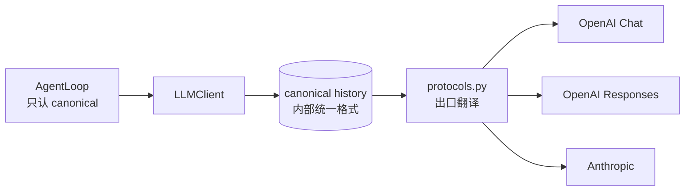
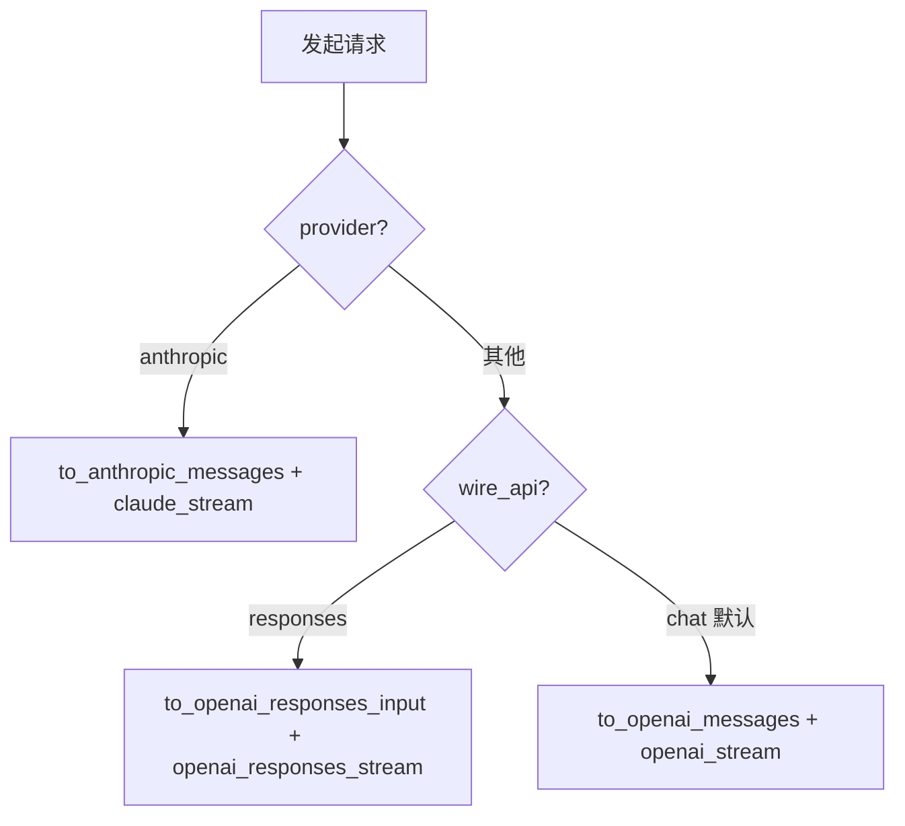
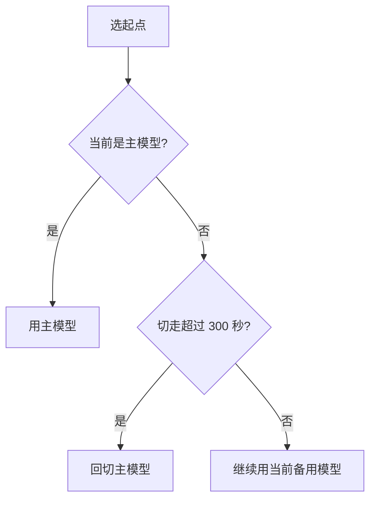

# 第 4 章：LLM 协议适配层

上一章在 `_run_function_calling` 里，AgentLoop 给 `LLMClient.chat()` 传的消息特别简单：

```python
messages = [{"role": "user", "content": task, ...}]
```

但你应该有个疑问：模型历史里要保存工具调用、工具结果、图片、思考过程……这么简单的结构怎么够用？而且 OpenAI 和 Anthropic 的请求格式完全不一样，Chrysalis 怎么同时支持？

这一章回答这两个问题。核心就一个词：**适配层**。Chrysalis 内部维护一份统一格式的历史，到了发请求那一刻，再翻译成具体某家厂商的协议。

## 4.1 问题：每家模型协议都不一样

先看看痛点有多痛。同样是"调一个工具又拿到结果"，三家协议长得完全不同。

OpenAI Chat 协议里，工具调用挂在 assistant 消息的 `tool_calls` 字段，工具结果是一条**独立的** `role: "tool"` 消息：

```json
{"role": "assistant", "tool_calls": [{"id": "call_1", "type": "function",
  "function": {"name": "file_read", "arguments": "{\"path\":\"README.md\"}"}}]}
{"role": "tool", "tool_call_id": "call_1", "content": "文件内容..."}
```

Anthropic 协议里，工具调用是 assistant 内容块里的一个 `tool_use` 块，工具结果是 user 内容块里的 `tool_result` 块：

```json
{"role": "assistant", "content": [{"type": "tool_use", "id": "toolu_1",
  "name": "file_read", "input": {"path": "README.md"}}]}
{"role": "user", "content": [{"type": "tool_result", "tool_use_id": "toolu_1",
  "content": "文件内容..."}]}
```

注意区别：OpenAI 的 `arguments` 是**字符串**，Anthropic 的 `input` 是**对象**；OpenAI 工具结果是独立消息，Anthropic 是塞在 user 块里。如果 AgentLoop 直接操作其中一种格式，想换另一家就得大改。

Chrysalis 的解法是经典的适配器模式：



> AgentLoop 和上层只认识一种格式——Chrysalis 自己的 **canonical history**。只有在 `protocols.py` 这个出口，才把它翻译成 OpenAI / Anthropic 的实际协议。想接一家新厂商？只改 `protocols.py`，上层一行不用动。

## 4.2 canonical history 长什么样

canonical history 的定义在 `chrysalis/llm/types.py`。一条消息就是一个 dict：

```python
{"role": "user" | "assistant" | "system", "blocks": [ ... ]}
```

关键是 `blocks`——内容不是一整段文本，而是一个**块列表**。块有这么几种类型（`types.py:159`）：

| 块类型 | 结构 | 含义 |
| --- | --- | --- |
| `text` | `{"type": "text", "text": ...}` | 普通文本 |
| `thinking` | `{"type": "thinking", "text": ..., "signature": ...}` | 模型的思考过程 |
| `tool_use` | `{"type": "tool_use", "id": ..., "name": ..., "arguments": ...}` | 工具调用（`arguments` 是**字符串**） |
| `tool_result` | `{"type": "tool_result", "tool_use_id": ..., "content": ..., "is_error": bool}` | 工具结果 |
| `image` | `{"type": "image", "media_type": ..., "data": ...}` | 图片（base64） |

为什么要设计成"块列表"而不是"一段文本"？因为一条 assistant 消息可能同时包含：一段思考 + 一段文本 + 一个工具调用。用块列表才能干净地表达这种混合内容，也才能无损地翻译到各家协议。

::: warning 一个关键细节
canonical 里 `tool_use.arguments` 永远是**字符串**（比如 `'{"path":"README.md"}'`）。翻译到 Anthropic 时会被解析成对象 `input`，翻译到 OpenAI 时直接当字符串放进 `function.arguments`。记住这点，后面看 `protocols.py` 就不会困惑。
:::

## 4.3 从简单消息到 canonical：_merge_user_message

回到开头的疑问：AgentLoop 传的是 `[{"role": "user", "content": task}]` 这么简单的东西，它怎么变成带 `blocks` 的 canonical 消息？答案在 `LLMClient._merge_user_message()`（`client.py:132`）。

它把 AgentLoop 风格的多条消息**合并成一条** canonical user 消息。逻辑是把各种内容分类收集，再按固定顺序拼起来：

```python
text_blocks, image_blocks, tool_result_blocks = [], [], []
answered_ids = set()

for msg in messages:
    if msg.get("role") == "system":
        continue                                       # system 单独处理，不进 blocks
    content = msg.get("content", "")
    if isinstance(content, str) and content:
        text_blocks.append({"type": "text", "text": content})
    for img in msg.get("images", []):
        image_blocks.append({"type": "image", ...})
    for tr in msg.get("tool_results", []):
        answered_ids.add(tr["tool_use_id"])
        tool_result_blocks.append({"type": "tool_result", "tool_use_id": ..., ...})

# 关键：补齐没被回答的工具调用
for tool_id in self._pending_tool_ids:
    if tool_id not in answered_ids:
        tool_result_blocks.append({"type": "tool_result", "tool_use_id": tool_id, "content": ""})

merged = {"role": "user", "blocks": tool_result_blocks + image_blocks + text_blocks}
```

两个要点：

1. **块顺序固定为 `tool_result + image + text`。** 工具结果排最前，图片其次，文本最后。
2. **`_pending_tool_ids` 补齐逻辑。** 这是个防御措施：上一轮模型发起了若干工具调用，它们的 id 被记在 `_pending_tool_ids` 里。如果这一轮发现某个 id 没有对应的 tool_result，就补一个空结果。为什么？因为协议要求**每个工具调用都必须有对应的结果**，否则请求会被厂商拒绝。这就是 4.1 节说的"硬性要求"。

## 4.4 出口翻译：protocols.py

canonical history 准备好后，发请求前要翻译成具体协议。三个翻译函数都在 `chrysalis/llm/protocols.py`。

### 翻译到 Anthropic：to_anthropic_messages

`to_anthropic_messages()`（`protocols.py:11`）遍历每条消息的 blocks，转成 Anthropic 的内容块：

```python
for block in msg["blocks"]:
    if block["type"] == "text":
        content_blocks.append({"type": "text", "text": ...})
    elif block["type"] == "thinking":
        # 只有 signature 和 text 都在，才输出
        if signature and text:
            content_blocks.append({"type": "thinking", "thinking": text, "signature": ...})
    elif block["type"] == "tool_use":
        content_blocks.append({"type": "tool_use", "id": ..., "name": ...,
                               "input": _parse_arguments(arguments)})   # 字符串→对象
    elif block["type"] == "tool_result":
        tr = {"type": "tool_result", "tool_use_id": ..., "content": ...}
        if is_error: tr["is_error"] = True
        content_blocks.append(tr)
```

注意两点：`tool_use` 的 `arguments`（字符串）经 `_parse_arguments` 解析成 `input`（对象）；`thinking` 块只在 `signature` 和 `text` 都存在时才发送（Anthropic 对带签名的思考块有严格要求）。

### 翻译到 OpenAI：to_openai_messages

`to_openai_messages()`（`protocols.py:74`）的形态差别更大，因为 OpenAI 把工具结果拆成独立消息：

```python
# assistant 消息：text 拼成 content，tool_use 拼成 tool_calls 数组
# 注意：thinking 块在 OpenAI 协议里直接丢弃
out.append({"role": "assistant", "content": text, "tool_calls": [...]})

# user 消息里的 tool_result：每个拆成一条独立的 role:"tool" 消息
out.append({"role": "tool", "tool_call_id": ..., "content": ...})

return _sanitize_tool_pairs(out)
```

两个关键差异：

- **thinking 块被丢弃。** OpenAI Chat 协议不支持单独的思考块，所以翻译时直接扔掉。这意味着用 OpenAI 协议时，模型的思考过程不会回传给下一轮。
- **`_sanitize_tool_pairs` 兜底。** 它（`protocols.py:235`）确保 `tool_calls` 和 `role:tool` 消息严格成对：没有对应结果的工具调用会被剔除，孤立的工具结果消息会被跳过。这是压缩历史后可能产生"断裂配对"的最后一道防线。

### 第三种：OpenAI Responses 协议

还有一个 `to_openai_responses_input()`（`protocols.py:157`），对应 OpenAI 较新的 Responses API。它用 `developer` 角色代替 system，工具调用是顶层的 `function_call` 项，结果是 `function_call_output`。走哪条路由由配置里的 `wire_api` 决定（`chat` 还是 `responses`）。

### 协议路由

到底用哪个翻译函数？看 `BaseSession._raw_ask_with_options()`（`session.py:106`）：



`provider` 是 `anthropic`/`claude` 就走 Anthropic 协议；否则看 `wire_api` 是 `responses` 还是默认的 `chat`。这三条路由覆盖了绝大多数 OpenAI 兼容服务和 Anthropic。

## 4.5 BaseSession：历史的生命周期

翻译只是一瞬间的事。维护历史、发请求、写回结果，是 `BaseSession`（`chrysalis/llm/session.py`）的活。它的核心是 `ask()` 方法（`session.py:45`）：

```python
def ask(self, message, cancel_event=None):
    with self._lock:
        self.history.append(message)                              # ① 追加新消息
        self.compaction.apply_preflight(self.history, ...)        # ② 预压缩
        # ③ 如果还接近上限，准备一个"让模型总结历史"的请求
        llm_summary_request = self.compaction.build_llm_summary_request(...) if ... else None

    if llm_summary_request:                                       # ④ 执行总结式压缩
        summary = self._run_compaction_summary(...)
        ...

    response = yield from self._ask_with_reactive_retry(...)      # ⑤ 真正请求模型
    if not response.is_error and not response.cancelled:
        self._append_assistant(response)                         # ⑥ 把回复写回历史
    return response
```

整个流程围绕**同一份 `self.history`** 转。这点很重要：

> 模型调用不是无状态的一问一答。每次请求，模型看到的都是积累至今的完整历史（用户输入、工具调用、工具结果……），只是当历史太长时会先压缩。这就是为什么 Agent 能"记得"前面做过什么。

第 ②③④ 步都和上下文压缩有关，我们留到 [第 5 章](/tutorial/context-compaction) 详讲。第 ⑥ 步 `_append_assistant()`（`session.py:214`）做的是反向操作：把模型返回的 `Response` 拆回 canonical blocks（thinking 块、text 块、tool_use 块）追加进历史。

如果你在调试"模型为什么忘了前面的事"，重点查三个地方：`self.history` 里有没有相关内容、是否发生了压缩、压缩后的摘要有没有保住关键事实。

## 4.6 多模型容错：FailoverSession

最后一块拼图。如果你配了多个模型（比如主用一个、备用另一个），`create_client()`（`llm/__init__.py:37`）会创建一个 `FailoverSession` 而不是普通 `BaseSession`：

```python
def create_client(configs, ...):
    if isinstance(configs, SessionConfig):
        return LLMClient(BaseSession(configs), ...)        # 单配置
    sessions = [BaseSession(c) for c in configs]
    if len(sessions) == 1:
        return LLMClient(sessions[0], ...)                 # 列表但只有一个
    return LLMClient(FailoverSession(sessions), ...)       # 多个 → Failover
```

`FailoverSession`（`failover.py:10`）也继承自 `BaseSession`，对上层透明——`LLMClient` 不知道自己拿的是单模型还是 Failover。它的 `ask()`（`failover.py:67`）会轮询多个模型：

```python
start_idx = self._pick_start()
for attempt in range(len(self.sessions)):
    idx = (start_idx + attempt) % len(self.sessions)
    session = self.sessions[idx]
    session.history = self.sessions[self._current_idx].history.copy()  # 同步历史
    # 尝试这个模型...
    if hit_error:
        continue                                           # 失败，换下一个
    if response 成功:
        self._current_idx = idx                            # 记住当前可用模型
        return response
```

它还有个聪明的"回切"机制 `_pick_start()`（`failover.py:123`）：



主模型挂了会切到备用；但切走 300 秒后，会再试一次主模型——万一它恢复了呢。这样既保证可用性，又不会一直赖在备用模型上。

## 4.7 用量统计：顺带说一句

每次请求完成，`LLMClient.chat()` 会调 `self.tracker.record_turn(response.usage)`（`client.py:113`），把这一轮的 token 累加进 `UsageTracker`。它分三级累计：单轮（turn）、单任务（task）、整个会话（session）。任务结束时 `Kernel.run()` 把 `task_usage_dict()` 附到结果的 `usage` 字段。

需要注意：内置价格表 `DEFAULT_PRICING` 当前是**空的**，所以默认 `cost` 估算是 0，除非你在配置里提供了价格。

## 4.8 动手练习

### 练习 A：在会话文件里找 canonical blocks

跑一个会用工具的任务，然后打开 `data/sessions/` 里最新的会话文件。会话保存的就是 canonical history。找一找：`tool_use` 块的 `arguments` 是字符串还是对象？`tool_use` 和 `tool_result` 的 id 是不是对得上？

### 练习 B：切换协议观察差异

如果你有 Anthropic 和 OpenAI 兼容两种服务，分别配置 `CHRYSALIS_LLM_PROVIDER=anthropic` 和 `=openai`，跑同一个带思考的任务。对照 4.4 节想一想：为什么 OpenAI 那次的会话历史里看不到 thinking 块？

### 练习 C：读懂 _sanitize_tool_pairs

打开 `protocols.py`，读 `_sanitize_tool_pairs()`。试着说清楚：如果历史里有一个 `tool_calls` 但它对应的 `role:tool` 消息被压缩删掉了，这个函数会怎么处理？（提示：它宁可剔除工具调用，也不伪造一个假结果。）这和 [第 5 章](/tutorial/context-compaction) 的 `repair_tool_pairs` 是配套的两道防线。

---

下一章我们解决一个绕不开的难题：任务越长历史越大，迟早超过模型上下文窗口。Chrysalis 怎么在不丢关键信息的前提下压缩历史？

→ [第 5 章：上下文压缩](/tutorial/context-compaction)
