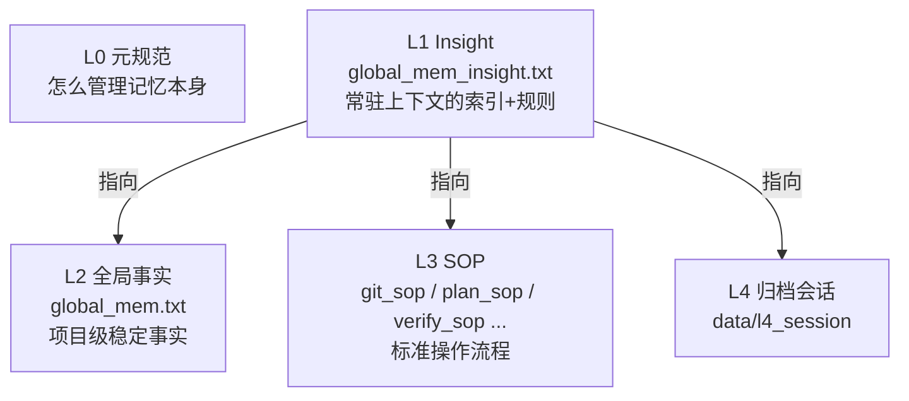
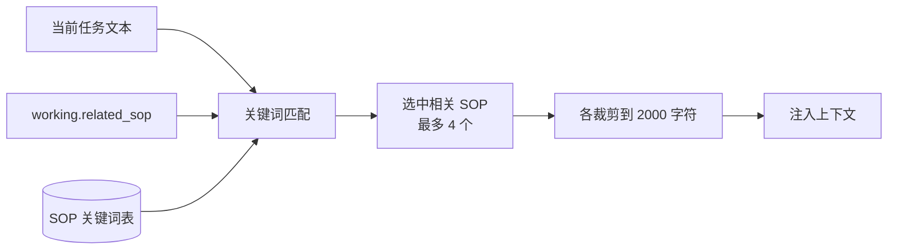
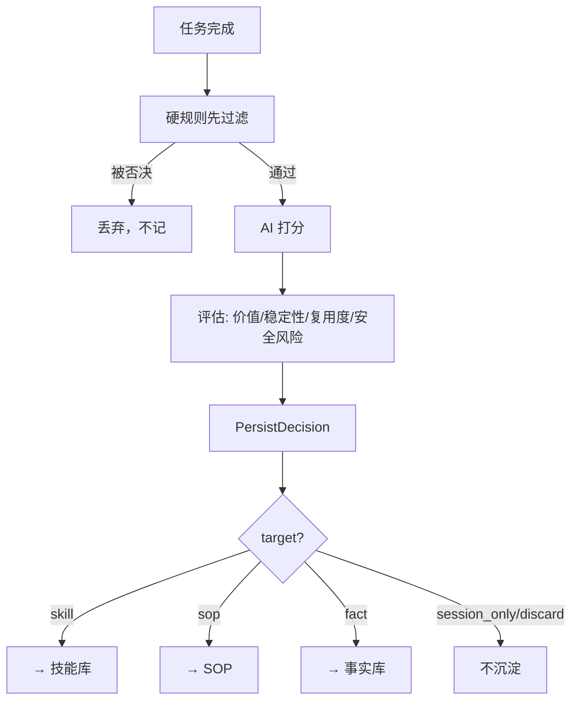

# 第 9 章：长期记忆

Working Memory 任务一结束就清空。但有些东西值得跨任务、跨会话保留下来：一套"用 git 提交的标准流程"、一条"这个项目的代码根目录在哪"的事实、一个"怎么登录某网站"的踩坑经验。

这一章讲 Chrysalis 怎么沉淀和复用这类长期经验：`memory/` 目录，以及决定"什么该记"的 `MemoryJudge`。

## 9.1 问题：怎么不每次都从零开始

没有长期记忆的 Agent，每次都是一张白纸。你这次教它"本项目 git 提交要先跑测试"，下次它又不知道了。理想的 Agent 应该像个老员工——干过的事、踩过的坑、总结的流程，下次能直接用上。

但长期记忆有个危险：**如果什么都记，就会记一堆垃圾**。模型某次猜错的路径、某次没验证的假设，如果被当成"经验"存下来，下次反而误导它。所以 Chrysalis 的长期记忆有一条铁律：

> **No Execution, No Memory（没有经过验证，就不值得记忆）。** 只有经过工具验证、确实有复用价值的东西，才进长期记忆。

## 9.2 分层记忆：L0 到 L4

`memory/` 目录里的内容不是一锅烩，而是分层的。看真实的 `memory/global_mem_insight.txt` 顶部，就能看到这套分层：

```text
L0(META-SOP): memory_management_sop      ← 关于"怎么管理记忆"的元规范
L2: global_mem.txt                        ← 全局事实库
L3: memory_cleanup_sop | plan_sop | verify_sop | git_sop | ...  ← 各种 SOP
L4: data/l4_session 历史会话              ← 归档的历史会话
```

把它整理成一张图：



关键是 **L1（`global_mem_insight.txt`）**：它很短，常驻在每轮上下文里。它本身不存大量内容，而是一份**索引 + 规则**——告诉模型"需要时去读 L2、去 ls memory/ 找 L3"，外加一批硬性规则（比如"改文件前必读""禁止 git reset --hard"）。

这样设计的好处：常驻上下文的只有薄薄一层索引，省 token；真正详细的 SOP（L3）按需加载，需要 git 操作时才读 `git_sop.md`。

## 9.3 SOP：可复用的标准流程

`memory/` 下那些 `*_sop.md` 文件是长期记忆的主力。SOP = Standard Operating Procedure，标准操作流程。看目录里真实存在的：

| SOP 文件 | 内容 |
| --- | --- |
| `git_sop.md` | git 操作规范（完整闭环、禁危险命令） |
| `plan_sop.md` | 复杂任务的规划流程 |
| `verify_sop.md` | 如何验证任务真的完成 |
| `web_setup_sop.md` | 浏览器环境准备 |
| `memory_cleanup_sop.md` | 怎么整理记忆 |
| `tmwebdriver_sop.md` | 浏览器疑难操作（文件上传、跨域 iframe…） |

这些 SOP 是经验的结晶。比如 `git_sop.md` 告诉模型"git 操作要走完整闭环、禁止 `git reset --hard`"——这样模型每次做 git 操作都遵循同一套安全流程，而不是临时发挥。

## 9.4 SOP 怎么按相关性进入上下文

不能把所有 SOP 都塞给模型——那又会撑爆上下文。ContextEngine 会**按当前任务挑相关的**。

`_select_related_files()`（`context_engine.py:304`）维护一张"SOP 关键词表"：每个 SOP 文件对应一组中英文关键词（比如 `git_sop.md` 对应 "git"、"提交"、"commit"）。它把任务文本和 Working Memory 里的 SOP 线索拼起来，匹配这些关键词，命中就选上——**最多选 4 个**。



所以当你的任务涉及 git，`git_sop.md` 会被自动检索进上下文；任务和 git 无关时它就不出现。这是一种轻量的"检索增强"——不需要向量数据库，靠关键词匹配就够用了。

L2 全局事实（`global_mem.txt`）也类似：`_global_memory_hits()`（`context_engine.py:478`）按任务关键词匹配事实块，挑出最相关的几条注入。

## 9.5 什么该记？MemoryJudge 来裁决

回到 9.1 节的铁律："只有验证过、有价值的才记。" 谁来判断？`MemoryJudge`（`chrysalis/memory/judge.py`）。

任务成功后，`AgentLoop` 会调 `_judge_memory()`，让 MemoryJudge 评估这次任务值不值得沉淀。它的判断分两步：



它产出一个 `PersistDecision`（`judge.py:27`），包含：要不要记（`should_persist`）、记成什么（`target`：skill / sop / fact / user_profile / 丢弃）、价值分、稳定性、复用可能性、**安全风险**。

注意 `target` 这个分流——同样是"值得记"，但记成"技能"还是"事实"还是"SOP"是不同的去向。这个决策会传给下一章的 `SkillCurator`，决定要不要生成技能草稿。

`Kernel._capture_memory_review()`（第 2 章见过）会接收这个决策：只有 target 是 `fact` 或 `user_profile` 且 `should_persist` 为真时，才进入记忆审查存储，等待进一步处理。

## 9.6 L1 指针：技能怎么"冒头"

还有一个有意思的机制。当一个技能被晋升为 active（下一章），`SkillStore._record_l1_pointer()` 会把这个技能的 `SKILL.md` 路径**追加写进 `global_mem_insight.txt`**（L1）。

看真实的 `global_mem_insight.txt` 末尾：

```text
skills/file-你把启动个人bot经验给沉淀一下吧/SKILL.md
skills/qq-official-send-local-image/SKILL.md
skills/qq-image-save-send/SKILL.md
```

这几行就是 L1 指针。因为 L1 常驻上下文，模型每轮都能看到"有这些技能可用"，需要时再去读完整的 `SKILL.md`。这就是技能从"存在硬盘上"到"被模型注意到"的桥梁。

::: tip 两条注入路径
长期经验进入上下文有两条路：① ContextEngine 按关键词检索相关 SOP / 事实（9.4 节，自动）；② 模型主动调 `skill_discover` 工具搜索技能（下一章，模型驱动）。再加上 L1 指针让技能"冒头"，三者配合。**注意：并不存在一个叫 `context_for_task` 的方法**——技能注入靠的是这套机制，别被旧文档误导。
:::

## 9.7 长期记忆 vs 工作记忆

再用一张表收尾，彻底区分两种记忆：

| | Working Memory | 长期记忆 |
| --- | --- | --- |
| 存哪 | 内存 | `memory/`、`skills/` |
| 生命周期 | 单次任务 | 跨会话长期 |
| 记什么 | 当前进度、TODO | 验证过的事实、SOP、技能 |
| 怎么进上下文 | 每轮自动注入当前快照 | 按相关性检索 / 模型主动搜 |
| 准入门槛 | 无（随时更新） | 高（MemoryJudge 裁决） |

## 9.8 动手练习

### 练习 A：读懂 L1

打开 `memory/global_mem_insight.txt`，对照 9.2 节，找出：哪几行是分层索引（L0~L4）？哪几行是硬性规则？哪几行是 L1 技能指针？理解为什么这份文件要尽量短。

### 练习 B：观察 SOP 检索

跑一个涉及 git 的任务（在一个 git 仓库里）：

```bash
chrysalis "查看当前 git 状态，并解释每个改动文件"
```

如果 `git_sop.md` 被检索进了上下文，模型的行为会遵循里面的规范。对照 9.4 节，想想是哪些关键词触发了检索。

### 练习 C：理解 MemoryJudge 的否决

打开 `judge.py`，看 `PersistDecision` 的字段和 `TARGETS` 集合。想清楚：一个"失败的任务"为什么不会被沉淀？一个"成功但只是闲聊"的任务，target 应该是什么？（提示：`session_only` / `discard`。）

---

长期记忆里最结构化、最可复用的一类是"技能"。下一章专门讲技能库——它怎么从一次成功任务里自动长出来。

→ [第 10 章：技能库](/tutorial/skills)
