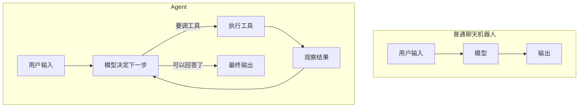
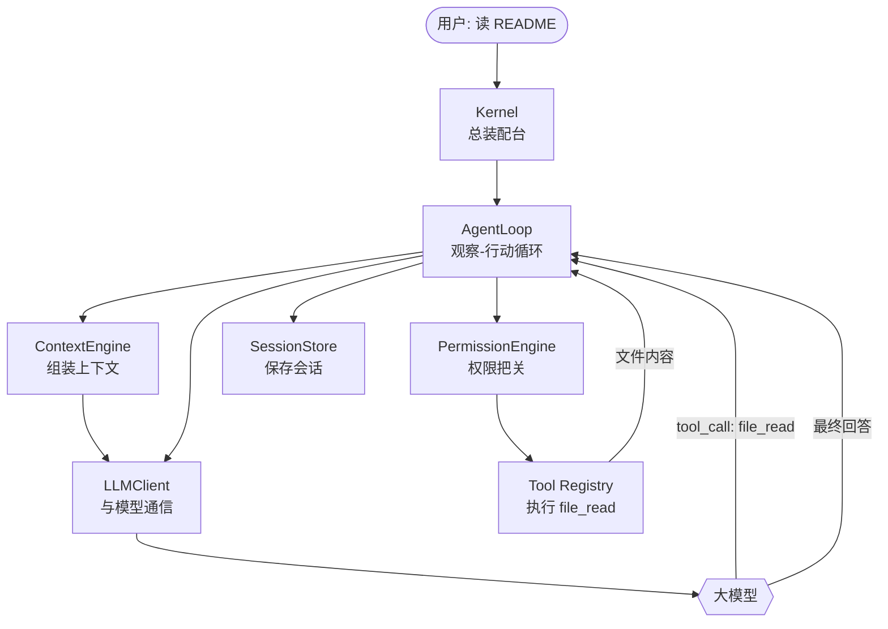
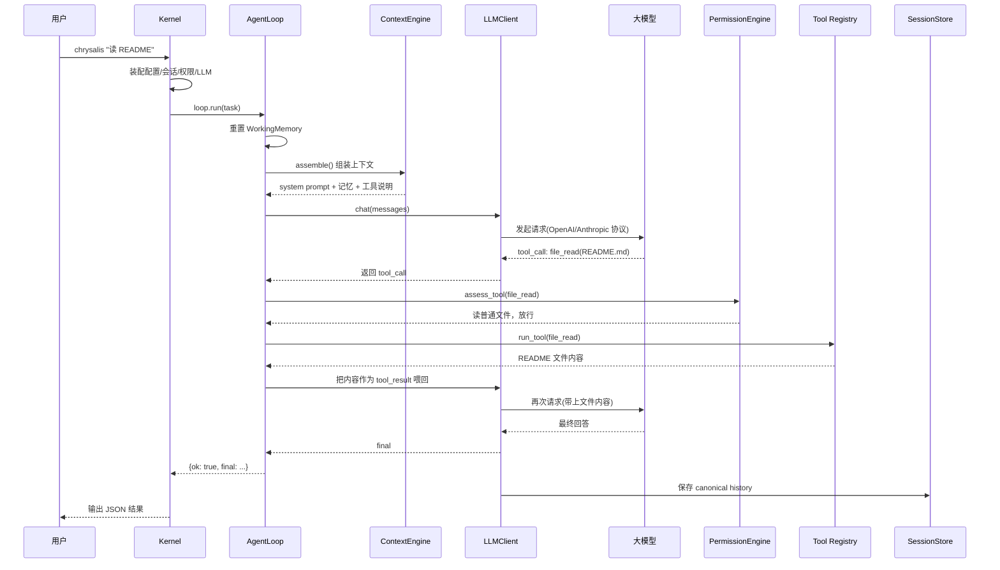

# 第 1 章：Agent 是什么

这一章不讲怎么用 Chrysalis，而是先回答一个更基础的问题：**一个"会用工具的 AI"到底是怎么运转的？** 把这件事想清楚，后面所有章节——工具、权限、记忆、上下文压缩——都只是它的细节。

读完本章，你应该能在脑子里画出一次任务从输入到结束的完整路径，并知道每一段路对应 Chrysalis 里的哪个对象。

## 1.1 从一个具体场景说起

假设你在终端里敲下这行命令：

```bash
chrysalis "请读取 README.md，告诉我这个项目最适合谁用"
```

如果 Chrysalis 只是个聊天壳，它会怎么做？它会把这句话发给大模型，模型回一段话——但模型根本没读过你的 `README.md`，它只能瞎猜，或者老实说"我看不到你的文件"。

而 Chrysalis 实际会这样做：

1. 模型看到任务，**决定**："我需要先读文件，我要调用 `file_read` 工具。"
2. Chrysalis 真的去执行 `file_read`，把 `README.md` 的内容读出来。
3. 文件内容作为"观察结果"**交回**模型。
4. 模型这次看到了真实内容，才给出回答。

这就是 Agent 和聊天机器人最本质的区别：



聊天机器人是一条直线，Agent 是一个**循环**。模型每次不是直接给答案，而是先决定"下一步做什么"——可能是调一个工具，也可能是给出最终回答。只要它选择调工具，循环就继续；直到它认为信息足够，才跳出循环输出答案。

这个循环有个经典名字：**观察-行动循环**（Observe–Act Loop），有时也叫 ReAct（Reasoning + Acting）。Chrysalis 把它实现在一个叫 `AgentLoop` 的类里，这是整个项目最核心的一段代码，我们会在第 2 章逐行拆它。

## 1.2 一个 Agent 至少要解决哪些问题

"让模型循环调工具"听起来简单，但要做成一个真正能用的本地 Agent，你会立刻撞上一连串问题。Chrysalis 的每个子系统，本质上都是在回答其中一个问题：

| 你会遇到的问题 | Chrysalis 的回答 | 对应章节 |
| --- | --- | --- |
| 模型怎么连？OpenAI、Anthropic 协议不一样怎么办？ | 内部统一的 canonical history + 协议适配层 | [第 4 章](/tutorial/llm-protocol) |
| 工具怎么暴露给模型？ | `@tool` 装饰器 + Tool Registry 自动生成 schema | [第 6 章](/tutorial/tools) |
| 模型要删库、要跑危险脚本怎么办？ | 三档权限引擎，在执行前拦截 | [第 7 章](/tutorial/permission) |
| 历史越来越长，超过模型上下文窗口怎么办？ | 运行时四级上下文压缩 | [第 5 章](/tutorial/context-compaction) |
| 长任务做到一半，模型"忘了"前面的事怎么办？ | Working Memory 记录进度、TODO、计划 | [第 8 章](/tutorial/working-memory) |
| 怎么让这次任务的经验，下次还能用上？ | memory/ 长期记忆 + skills/ 技能库 | [第 9、10 章](/tutorial/long-term-memory) |
| CLI、TUI、桌面端、网关要各写一套吗？ | 全部复用同一个 Kernel | [第 2、11 章](/tutorial/kernel-and-loop) |

你不需要现在就理解这张表的每一行。它的作用是给你一张"地图"：当你读到某一章时，回头看这里，就知道这一章在整个系统里解决的是哪个问题。

## 1.3 五个核心角色

Chrysalis 的代码不小，但你只要先记住五个角色，就能抓住主线。我们用刚才那个"读 README"的任务，看它们各自在做什么。



**Kernel（总装配台）** —— 位于 `chrysalis/kernel.py`。它是你执行命令后第一个被创建的对象。它的职责不是干活，而是"装配"：读配置、建会话存储、建权限引擎、建模型客户端，最后把这些组装成一个 `AgentLoop`。你可以把它理解成一家餐厅的后厨总管：它自己不炒菜，但负责把灶台、食材、厨师都准备齐。

**AgentLoop（观察-行动循环）** —— 位于 `chrysalis/agent_loop.py`。这是 Agent 真正"动起来"的地方。1.1 节那个循环就在这里：问模型、拿到 tool_call、检查权限、执行工具、把结果喂回模型、再问……直到模型给出最终回答。

**ContextEngine（上下文组装）** —— 位于 `chrysalis/context_engine.py`。模型每次只能看到有限的内容，不能把所有东西都塞给它。ContextEngine 负责在每轮请求前挑重点：当前任务需要哪些长期记忆？有哪些待办 TODO？相关的技能是什么？它把这些拼成一份系统提示词。

**LLMClient（与模型通信）** —— 位于 `chrysalis/llm/`。它负责把消息发给模型、拿回结果。但它做的远不止"发请求"：它维护一份统一格式的历史（canonical history），在请求前压缩过长的历史，并把统一格式转成 OpenAI 或 Anthropic 的实际协议。

**Tool Registry + PermissionEngine（执行与把关）** —— 位于 `chrysalis/tools/` 和 `chrysalis/permission.py`。前者是所有工具的注册表，模型说要调 `file_read`，它就找到对应函数去执行。后者是安全闸门：在工具真正执行前，判断这个动作要不要先问问用户。

最后还有 **SessionStore**（`chrysalis/session_store.py`）默默把整段对话历史存进 `data/sessions/`，这样你下次还能加载回来继续。

## 1.4 一次任务的完整时序

现在把五个角色串起来，看"读 README"这个任务从头到尾的完整时序。这张图是整本书的骨架，后面每一章都是在放大它的某一段。



注意图里有个**回环**：模型第一次返回的不是答案，而是 `file_read` 这个工具调用。AgentLoop 执行完工具后，把结果喂回模型，模型第二次才给出最终回答。如果任务更复杂，比如"读完 README 再改一处错别字"，这个回环会转更多圈：读文件 → 改文件 → 验证 → 才结束。

## 1.5 一个常被误解的点：是谁在"思考"？

初学者很容易把 AgentLoop 想象成一个聪明的大脑。其实恰恰相反：

> **AgentLoop 一点都不"聪明"。所有的判断、推理、决策都来自大模型。AgentLoop 只是一个忠实的执行器：它把模型要的工具跑一遍，把结果原样递回去。**

举个例子，模型读完 `README.md` 后发现里面提到"适合三类人"，于是直接组织出答案——这个"理解文件、提炼要点"的过程发生在模型内部，不在 AgentLoop 里。AgentLoop 做的只是：解析出模型要调 `file_read`、检查权限、调用函数、把返回值转成文本喂回去。

想清楚这条分工，你就不会在读 `agent_loop.py` 时困惑"它怎么知道该读哪个文件"——它不知道，是模型告诉它的。

## 1.6 本书的阅读约定

这本教程有一套统一的写法，先说明一下：

- **每章从一个真实问题切入**，而不是上来就堆概念。
- **代码片段都来自真实源码**。我们会标出它在哪个文件、哪个函数，你完全可以打开对应文件对照着读。为了聚焦，部分片段会省略与当前话题无关的行，但不会改写逻辑。
- **流程图用 Mermaid 绘制**，可以缩放查看。
- **每章结尾有动手练习**，强烈建议真的去敲一遍——读懂和会改是两回事。

::: tip 边读边跑
最好的学习方式是开两个窗口：一个看文档，一个开着 `chrysalis/` 源码和一个终端。每读到一个函数，就去源码里找到它；每读到一个命令，就去终端里跑一遍。
:::

## 1.7 动手练习

### 练习 A：观察一次真实的工具循环

先把项目跑起来（如果还没装，先看 [安装指南](/guide/installation)），然后执行：

```bash
chrysalis "请读取 README.md，告诉我这个项目最适合谁用"
```

任务结束后，打开 `data/sessions/` 目录，找到最新的那个 `.json` 文件。在里面搜索 `file_read`，你会看到模型发起的工具调用（`tool_use`）和工具返回的结果（`tool_result`）成对出现。这就是 1.1 节那个循环留下的痕迹。

### 练习 B：在脑子里画一遍时序

不看 1.4 节的图，试着自己说出下面这个任务会经历哪几步：

```bash
chrysalis "把 workspace/note.txt 里的 'helo' 改成 'hello'"
```

提示：它至少要读文件、改文件，而改文件这个动作在 `balanced` 权限下会触发什么？（答案在 [第 7 章](/tutorial/permission)。）

### 练习 C：找到五个角色

打开 `chrysalis/kernel.py`，找到 `Kernel.__init__()` 方法。试着在里面找出 1.3 节提到的五个角色分别在哪一行被创建。这正是下一章的内容。

---

下一章，我们就钻进 `kernel.py` 和 `agent_loop.py`，看 Kernel 如何把这五个角色装配起来，以及那个观察-行动循环到底是怎么写的。

→ [第 2 章：Kernel 装配与观察-行动循环](/tutorial/kernel-and-loop)
