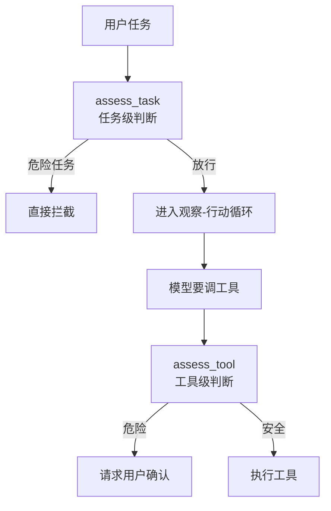
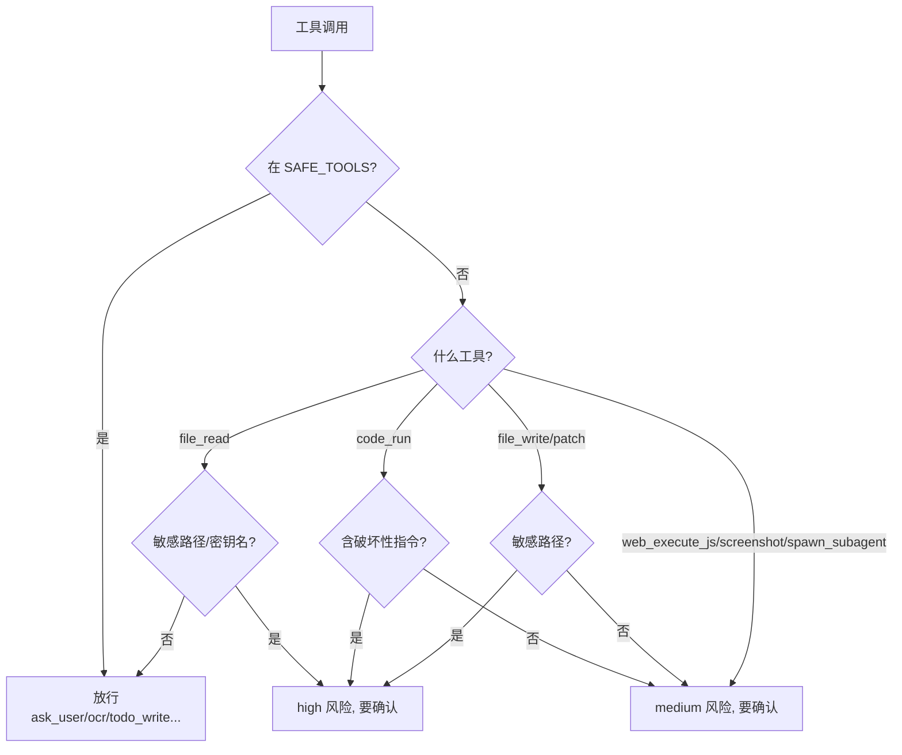
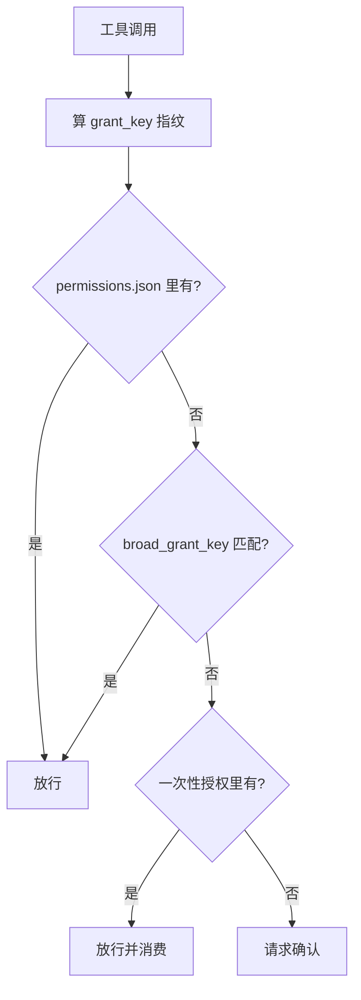

# 第 7 章：权限系统

上一章我们看到，Chrysalis 能读文件、写文件、跑脚本、操作浏览器。这是 Agent 的力量，但也是它的危险所在——模型如果"理解错了"或被恶意输入误导，可能删掉重要文件、跑出危险命令。

这一章讲那道安全闸门：`chrysalis/permission.py` 里的 `PermissionEngine`。它的职责是在动作真正发生前判断——这件事要不要先问问用户？

## 7.1 问题：本地 Agent 的权力边界

聊天机器人最多输出一段文字，它没法碰你的文件系统。但 Chrysalis 是本地 Agent，它能：

- 写、覆盖、删除文件
- 执行任意 Python / shell 脚本
- 在你的浏览器里执行 JavaScript（带着你的登录态）
- 截屏（可能含隐私信息）

这些能力一旦失控，后果是真实的。所以必须有一层"在执行前思考一下"的机制。但又不能什么都问——如果读个文件都要确认，Agent 就没法用了。

核心矛盾：**既要拦住危险动作，又不能烦死用户。** Chrysalis 的答案是"按风险分级 + 按等级决策"。

## 7.2 三档权限等级

权限等级由 `.env` 的 `CHRYSALIS_PERMISSION_LEVEL` 控制，有三档（`PermissionLevel = Literal["locked", "balanced", "full"]`）：

| 等级 | 适合场景 | 行为 |
| --- | --- | --- |
| `locked` | 你想非常保守 | 连"看起来会改东西"的任务都会先问 |
| `balanced` | **日常推荐** | 只读操作直接放行；写文件、跑脚本等会问 |
| `full` | 完全信任的环境 | 几乎不问，全部放行 |

它还支持一堆别名（`_normalize_level`，`permission.py:845`），方便记忆：

```text
strict / safe / ask      → locked
normal / default         → balanced
trusted / off / none     → full
```

还记得第 2 章 2.2 节吗？如果等级是 `full`，`Kernel` 干脆装配一个 `FullAccessPermissionEngine`——它的 `assess_task` / `assess_tool` 永远返回 allow，彻底绕过所有判断。其余等级才用真正会思考的 `PermissionEngine`。

## 7.3 两道关：任务级 + 工具级

权限判断发生在两个时机：



### 第一道：assess_task（任务级）

`assess_task()`（`permission.py:368`）在循环开始**之前**判断整个任务。逻辑很直接：

```python
def assess_task(self, task, session_context=""):
    if self.level == "full":
        return allow
    if 命中 DANGEROUS_TASK_PATTERNS:           # shutdown / rm -rf / 清空磁盘 ...
        return deny(risk=high)
    if should_ask and _looks_mutating_task(task):  # 看起来会改东西
        return ask
    return allow
```

如果任务一看就危险（比如直接说"删除整个系统"），在这里就被拦了，根本不进循环。这是第一道防线。

### 第二道：assess_tool（工具级）

`assess_tool()`（`permission.py:397`）在**每个工具执行前**判断。这是更精细的一道关，第 2 章的 `_execute_tool_with_guards` 调的就是它。

它的核心是 `_request_for_tool()`（`permission.py:479`）——为不同工具判定风险：



几条规则值得记住：

- **`SAFE_TOOLS`**（`ask_user`、`ocr`、`todo_write`、`update_working_checkpoint`、`start_long_term_update`）永远放行——它们不碰文件系统，没有风险。
- **`file_read` 默认放行**，只有读敏感路径（`.git`、`.venv`、`node_modules` 等 `SENSITIVE_PATH_PARTS`）或密钥文件名时才拦。读普通文档不会烦你。
- **`code_run` 一定要确认**，含破坏性指令（`HIGH_RISK_CODE_PATTERNS`：`shutil.rmtree`、`rm -rf`、`shutdown` 等）算 high 风险，普通脚本算 medium。
- **`file_write` / `file_patch`** 写敏感路径算 high，普通写算 medium。

判断结果只有三种状态：`allow`（放行）、`ask`（问用户）、`deny`（拒绝）。

## 7.4 你会看到的四个选择

当 `assess_tool` 返回 `ask`，循环停下来，把权限请求交给界面。你通常会看到四个选择，它们经 `resolve_user_choice()`（`permission.py:456`）映射成动作：

| 你的选择 | 内部动作 | 效果 |
| --- | --- | --- |
| 允许本次 | `allow_once` | 只放行这一次，加进一次性授权集合 |
| 永久允许 | `allow_always` | 写入 `permissions.json`，以后同类自动通过 |
| 拒绝 | `deny` | 不执行，把"用户拒绝了"作为上下文交回，让 Agent 换方案 |
| 详细说明 | `detail` | 展示工具、风险等级、参数预览 |

"拒绝"不是死路——它会变成额外上下文喂回模型（第 2 章 `_resolve_pending_user_action`），让 Agent 知道这条路走不通，去找别的办法。

## 7.5 授权指纹：为什么"永久允许"不会过度放权

选"永久允许"后，Chrysalis 怎么知道下次哪些操作算"同类"？靠**授权指纹**（`grant_key`，`permission.py:195`）：

```python
grant_key = sha256({kind, tool, summary, _stable_details()})[:24]
```

它对工具名、操作摘要、关键参数算哈希。下次来一个工具调用，算出同样的指纹，才认为是"同类"自动放行。

但这里有个微妙的设计。对 `code_run`、`web_execute_js` 这类工具，指纹用的是**脚本内容的哈希**（`script_hash`），而不是原始脚本——这意味着你授权了"跑脚本 A"，不等于授权"跑脚本 B"。同时还有一个 `broad_grant_key`（`permission.py:206`）提供更宽泛的授权（比如按"python 脚本 + 某个工作目录"授权），让你能选择授权粒度。



永久授权存在 `permissions.json`（路径由 `store_path` 决定，默认 `data/permissions.json`），由 `PermissionStore`（`permission.py:262`）管理，结构是 `{"version": 1, "grants": {...}}`。

## 7.6 网关场景：默认不信任远程

还有第三种引擎：`GatewayPermissionEngine`（`permission.py:738`）。当你把 Agent 接到 QQ / 微信 / 飞书时（第 11 章），远程聊天的人不是你本人，不能享有本机权限。

它的策略完全不同——**默认不信任**：

- 一批工具永远拒绝（`GATEWAY_ALWAYS_DENY_TOOLS`）；
- `file_read` / `ocr` 被限制在白名单目录（`allowed_read_roots`）；
- `web_fetch` 只能访问公网 URL；
- **`resolve_user_choice` 永远返回 deny**——远程用户根本没法"批准"本机权限请求。

这就是为什么 README 里反复强调：网关默认把远程聊天当不可信输入。你可以用 `CHRYSALIS_GATEWAY_ALLOWED_TOOLS` 额外开放工具，但开放前务必确认环境可信。

三种引擎对比：

| 引擎 | 用于 | 基本态度 |
| --- | --- | --- |
| `PermissionEngine` | 本机 locked/balanced | 按风险分级判断 |
| `FullAccessPermissionEngine` | 本机 full | 全部放行 |
| `GatewayPermissionEngine` | 消息网关 | 默认拒绝，白名单放行 |

## 7.7 权限在代码里的位置

| 想改什么 | 看哪里 |
| --- | --- |
| 调整哪些工具算安全/要确认 | `SAFE_TOOLS` / `ASK_TOOLS`（`permission.py:23`、`:71`） |
| 调整危险任务/代码模式 | `DANGEROUS_TASK_PATTERNS` / `HIGH_RISK_CODE_PATTERNS` |
| 调整敏感路径 | `SENSITIVE_PATH_PARTS` |
| 改单个工具的风险判定 | `_request_for_tool()` |
| 改授权指纹粒度 | `grant_key` / `broad_grant_key` |
| 改网关白名单 | `GatewayPermissionEngine` 相关常量 |

## 7.8 动手练习

### 练习 A：感受三档等级

分别用三档等级跑同一个写文件任务：

```bash
CHRYSALIS_PERMISSION_LEVEL=locked chrysalis "在 workspace/a.txt 写入 hello"
CHRYSALIS_PERMISSION_LEVEL=balanced chrysalis "在 workspace/a.txt 写入 hello"
CHRYSALIS_PERMISSION_LEVEL=full chrysalis "在 workspace/a.txt 写入 hello"
```

观察哪几档会停下来要确认。对照 7.2 节理解差异。

### 练习 B：观察"拒绝"如何变成上下文

进入交互模式，给一个写文件任务，在确认时选"拒绝"。观察 Agent 接下来的反应——它应该意识到不能写文件，转而提议别的方案。对照 7.4 节和第 2 章的 `_resolve_pending_user_action`。

### 练习 C：读懂一次风险判定

打开 `permission.py`，找到 `_request_for_tool()`。挑 `code_run` 那个分支，读清楚：它在什么情况下把风险定为 high、什么情况下是 medium？然后想一想——为什么 `code_run` 即使是普通脚本也至少是 medium，而 `file_read` 普通情况直接放行？

---

行动层讲完了。接下来三章进入记忆层：怎么让 Agent 在长任务里记住进度、跨任务复用经验。

→ [第 8 章：工作记忆](/tutorial/working-memory)
