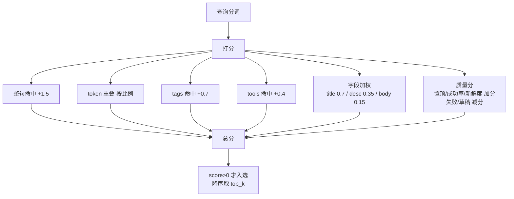
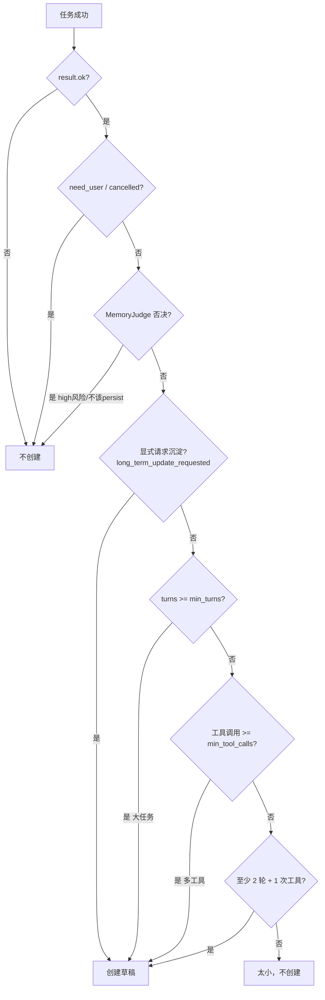
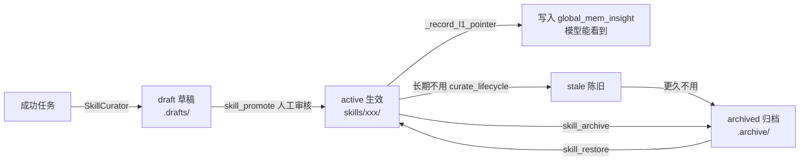

# 第 10 章：技能库

上一章的长期记忆里，最结构化、最可复用的一类是"技能"。如果说 SOP 是一篇篇手册，技能就是**可搜索、可审核、可晋升的工作流单元**——而且它能从一次成功的任务里**自动长出来**。

这一章讲 `skills/` 目录、`SkillStore` 和 `SkillCurator`。

## 10.1 技能和 SOP 有什么不同

它俩都是长期经验，区别在形态和生命周期：

| | SOP（`memory/*_sop.md`） | 技能（`skills/`） |
| --- | --- | --- |
| 形态 | 一篇 Markdown 手册 | 一个目录（元数据 + 正文 + 资源） |
| 来源 | 人工编写 | 可由成功任务**自动生成草稿** |
| 检索 | ContextEngine 按关键词 | `SkillStore.search()` 打分排序 |
| 生命周期 | 手动维护 | draft → active → archived，有晋升/归档流程 |
| 准入 | 直接放进 memory/ | 草稿要审核才晋升 |

简单说：**SOP 偏静态规范，技能偏动态沉淀**。技能有一整套"从草稿到生效到归档"的生命周期管理。

## 10.2 一个技能长什么样

技能存在 `skills/` 下，每个技能是一个目录：

```text
skills/
  qq-image-save-send/           ← active 技能（扁平布局）
    skill.json                  ← 机器可读元数据
    SKILL.md                    ← 模型可读正文
    scripts/                    ← 可选：配套脚本
  .drafts/                      ← 草稿区
    some-new-skill/
  .archive/                     ← 归档区
    old-skill/
```

两个核心文件（`store.py` 常量 `SKILL_JSON` / `SKILL_MD`）：

- **`skill.json`**：元数据——id、名字、描述、分类、标签、状态、版本、统计数据（用过几次、成功几次）、是否置顶。
- **`SKILL.md`**：正文——模型实际读的内容，包含 About（这是什么）、When To Use（什么时候用）、Steps（步骤）、Failure Modes（失败模式）等段落。

状态分三种：`active`（生效，扁平目录）、`draft`（草稿，在 `.drafts/`）、`archived`（归档，在 `.archive/`）。还有个 `stale`（陈旧）用于生命周期管理。

## 10.3 技能怎么被搜到：search 打分

模型调 `skill_discover` / `skill_search` 工具时，底层是 `SkillStore.search()`（`store.py:129`）。它不是简单的关键词匹配，而是**多维度打分**。

先把查询和技能都分词（`_tokens`：英文按词、中文按单字和 bigram），然后叠加多项得分：



`_quality_score` 这一项很关键：用得多、成功率高、最近用过的技能加分；失败多的、还是草稿的减分。这样搜索结果会自然倾向"被验证过好用"的技能——又一次体现"No Execution, No Memory"的精神。

默认只搜 active 技能（`include_drafts=False`），草稿不会污染搜索结果。

## 10.4 技能怎么自动生成：SkillCurator

这是技能库最有意思的部分：**一次成功的复杂任务，可能自动变成一个技能草稿**。

第 2 章讲过，任务成功后 `AgentLoop._maybe_create_skill_draft()` 会调 `SkillCurator.maybe_create_draft()`（`curator.py:43`）。它先判断"这次任务值不值得沉淀"（`_should_create`，`curator.py:264`）：



触发条件按优先级排（结合上一章的 `MemoryJudge` 决策）：

1. 任务失败 / 需要用户介入 / 被取消 → 不创建。
2. MemoryJudge 判定不该持久化、或安全风险高 → 不创建。
3. 模型显式调过 `start_long_term_update` → 创建。
4. 任务足够大（轮数 ≥ 阈值）→ 创建。
5. 用了足够多工具 → 创建。
6. 否则太小，不创建。

注意 `AgentLoop` 里创建 curator 时传的是 `min_turns=4, min_tool_calls=2, auto_promote=False`——门槛不高，但**默认不自动晋升**。

## 10.5 草稿 → 生效：为什么要人工审核

`_should_create` 通过后，`maybe_create_draft` 会推断分类、名字、用到的工具，组装元数据，调 `store.create(status="draft")` 生成一个**草稿**，还会写一份 `trace.json` 记录这次任务的轨迹，并用 `validate_skill` 校验（检查是否有必要的段落）。

但草稿**不会自动生效**：

> 草稿存在 `.drafts/` 里，搜索默认搜不到它，也不会注入上下文。它必须经过审核，通过 `skill_promote` 晋升为 active，才会真正被用上。

为什么这么谨慎？因为自动生成的草稿质量参差不齐——可能名字不好、步骤不清、或者只是个一次性操作。让它默认停在草稿区、需要人看一眼才晋升，是一道质量闸门。整个生命周期：



晋升为 active 时，还记得上一章的 `_record_l1_pointer` 吗？它会把技能写进 L1 索引，让模型注意到。这就闭环了：成功任务 → 草稿 → 审核晋升 → 进 L1 → 下次被模型搜到复用。

## 10.6 技能工具一览

模型通过这组工具管理技能（第 6 章清单里有）：

| 工具 | 作用 |
| --- | --- |
| `skill_discover` | 为当前任务发现可用技能（只搜 active） |
| `skill_search` / `skill_list` / `skill_view` | 搜索 / 列出 / 查看技能 |
| `skill_create` | 创建草稿或 active 技能 |
| `skill_promote` | 草稿晋升为 active |
| `skill_archive` / `skill_restore` | 归档 / 恢复 |
| `skill_pin` | 置顶（搜索加权） |
| `skill_install` | 从本地目录安装技能 |
| `skill_curate` | 运行生命周期维护（标记 stale、归档） |

`skill_curate` 对应 `curate_lifecycle()`（`store.py:552`）：默认超过 30 天没用标记为 stale，超过 90 天归档（跳过置顶和草稿）。这让技能库不会无限膨胀。

## 10.7 自动沉淀的完整闭环

把这一章和前面串起来，看一个技能从无到有的全过程：

```text
1. 你让 Agent 完成一个复杂任务（比如"配置个人 QQ 机器人"），成功了
2. AgentLoop 任务成功 → MemoryJudge 评估 → 值得沉淀
3. SkillCurator._should_create 通过（任务够大 / 显式请求）
4. 生成草稿到 .drafts/，附 trace.json，validate 校验
5. 你审核草稿，觉得不错 → skill_promote 晋升
6. _record_l1_pointer 把它写进 global_mem_insight.txt
7. 下次类似任务，模型 skill_discover 搜到它 → 直接复用经验
8. 用得多、成功率高 → search 打分时排更前
9. 长期不用 → skill_curate 标记 stale → 最终归档
```

这就是 Chrysalis"越用越聪明"的机制：经验不是凭空写的，而是从真实成功任务的轨迹里长出来的。

## 10.8 动手练习

### 练习 A：浏览现有技能

看看 `skills/` 目录下已有的技能，打开任意一个的 `skill.json` 和 `SKILL.md`，对照 10.2 节理解结构。再看 `.drafts/` 里有没有未晋升的草稿。

### 练习 B：触发一次草稿生成

让 Agent 完成一个用到多个工具、多轮的任务（比如"读取某个脚本、解释它、再写一个测试文件"）。任务成功后，检查 `skills/.drafts/` 是否多了草稿。对照 10.4 节的判定流程，想想是哪个条件触发的。

### 练习 C：读懂打分

打开 `store.py` 的 `search()`，找到 `_quality_score`。想清楚：两个内容相似的技能，一个被用过 10 次且全成功、一个还是草稿，搜索时谁排前面？为什么这样的设计能让技能库"自我提纯"？

---

到这里，Chrysalis 的核心五层（内核、模型、行动、记忆）都讲完了。最后两章进入进阶：子 Agent、网关、桌面端这些架构，以及怎么动手扩展 Chrysalis。

→ [第 11 章：子 Agent、网关与桌面端](/tutorial/architecture-extras)
