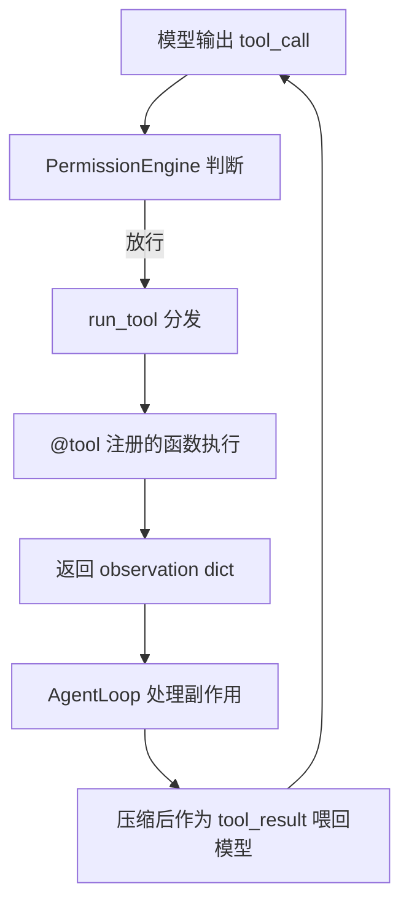
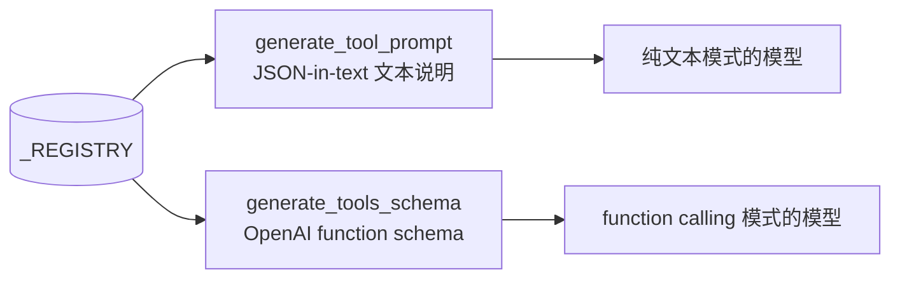
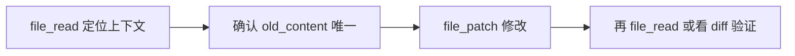

# 第 6 章：工具调用

前五章我们把模型层讲透了：怎么和模型通信、历史怎么存、长了怎么压。但这些都只是"说"。这一章进入行动层——Agent 真正"做事"的地方。

模型说"我要调用 `file_read`"，这句话怎么变成真的去读一个文件？工具又是怎么注册、怎么让模型知道有哪些工具可用？这一章拆 `chrysalis/tools/`。

## 6.1 工具是 Agent 和聊天机器人的分水岭

再强调一次第 1 章的核心认知：

> 模型本身**不会**真的读文件。模型只会说"我想调用 `file_read` 读 README.md"。是 Chrysalis 真的执行 `file_read`，把结果交回模型。

聊天机器人最多告诉你"你可以运行 `cat README.md`"；Agent 能真的去运行、拿到输出、再根据输出决定下一步。这个"能真的去做"的能力，全靠工具系统。

一次工具调用的完整链路（第 2 章见过，这里聚焦工具侧）：



## 6.2 工具怎么注册：@tool 装饰器

所有工具都用一个 `@tool(...)` 装饰器注册。看它的真身（`chrysalis/tools/registry.py:21`）：

```python
_REGISTRY: dict[str, ToolDef] = {}

def tool(name, description, params=None):
    def decorator(fn):
        _REGISTRY[name] = ToolDef(name=name, description=description,
                                  params=params or {}, fn=fn)
        return fn
    return decorator
```

短得惊人。`@tool(...)` 的本质就一句话：**把函数塞进全局字典 `_REGISTRY`**。`ToolDef` 是个简单的 dataclass，存了工具名、说明、参数描述和函数本身。

一个真实工具长这样（`file_tools.py`）：

```python
@tool("file_read", "读取文件内容，可按行号或关键词定位", params={
    "path": "文件路径",
    "start": "起始行号(默认1)",
    "count": "读取行数(默认200)",
    "keyword": "搜索关键词(可选)",
    "show_linenos": "显示行号(默认true)",
})
def file_read(args: dict, workspace: Path | None = None) -> dict:
    ...
```

所有工具函数的签名都统一成 `(args: dict, workspace=None) -> dict`。参数从 `args` 字典取，结果返回一个 dict。这个统一签名让 `run_tool` 能用同一种方式调用任何工具。

## 6.3 一个关键陷阱：模块必须被导入

`@tool` 只在**模块被导入时**才执行注册。如果你写了个工具模块但没人 import 它，装饰器根本不运行，模型永远看不到这个工具。

所以 `chrysalis/tools/__init__.py` 主动导入了所有工具模块：

```python
import chrysalis.tools.file_tools
import chrysalis.tools.web_tools
import chrysalis.tools.code_tools
import chrysalis.tools.agent_tools
import chrysalis.tools.skill_tools
import chrysalis.tools.vision_tools

TOOL_PROMPT = generate_tool_prompt()    # JSON-in-text 模式用
TOOLS_SCHEMA = generate_tools_schema()  # function calling 模式用
```

导入这六个模块 → 触发所有 `@tool` 注册 → `_REGISTRY` 填满 → 生成两份"工具说明"。

::: warning 新增工具记得 import
这是新手最常踩的坑：写了工具函数，加了 `@tool`，但模型就是看不到。十有八九是忘了在 `tools/__init__.py` 里 import 你的模块。
:::

## 6.4 模型怎么"知道"有哪些工具

`_REGISTRY` 是给 Python 用的，模型看不懂。`registry.py` 把它转成模型能理解的两种形式：



- **`generate_tools_schema()`**（`registry.py:70`）生成 OpenAI function calling 的标准 schema，每个参数统一描述成 string 类型。这是主线模式。
- **`generate_tool_prompt()`**（`registry.py:48`）生成一段纯文本说明，告诉模型"有这些工具，用 `{"tool":..., "args":...}` 这样的 JSON 调用"。这是 fallback——有些模型不支持原生 function calling，就退回用文本约定。

当前主线走 function calling（`AgentLoop.use_function_calling=True`），JSON-in-text 作为兼容保留。

注意 schema 里**所有参数都是 string 类型**，也没有生成 `required` 字段。这是刻意简化：schema 越简单，各家模型越不容易出错。代价是工具函数内部要自己做类型转换——你会在代码里看到 `int(args.get("start", 1))`、`as_bool(args.get("show_linenos", True))` 这样的转换。

## 6.5 完整工具清单

Chrysalis 的工具按六个模块分组。这是当前真实注册的全部工具：

| 模块 | 工具 | 作用 |
| --- | --- | --- |
| **file** | `file_read` | 读文件，可按行号窗口/关键词定位 |
| | `file_write` | 写文本（overwrite / append / prepend） |
| | `file_patch` | 替换文件中**唯一匹配**的文本块 |
| **code** | `code_run` | 执行 Python / powershell / bash |
| **web** | `web_scan` | 用本机浏览器打开/扫描页面 |
| | `web_fetch` | 抓取公网 HTTP/HTTPS（不依赖浏览器登录态、无 JS） |
| | `web_execute_js` | 在当前浏览器标签执行 JavaScript |
| **vision** | `screenshot` | 截屏（图片回传给模型观察） |
| | `ocr` | 图片文字识别（RapidOCR） |
| **agent** | `ask_user` | 阻塞向用户提问 |
| | `todo_write` | 维护当前任务的 TODO 列表 |
| | `update_working_checkpoint` | 更新短期工作记忆 |
| | `start_long_term_update` | 标记本次任务值得沉淀 |
| | `spawn_subagent` | 派生子 Agent 执行子任务 |
| | `gateway_connect` | 启动消息网关 |
| **skill** | `skill_discover` / `skill_search` / `skill_view` | 发现、搜索、查看技能 |
| | `skill_list` / `skill_status` | 列出技能、查看状态 |
| | `skill_create` / `skill_promote` / `skill_archive` | 创建、晋升、归档 |
| | `skill_restore` / `skill_pin` / `skill_install` / `skill_curate` | 恢复、置顶、安装、整理 |

下面挑几个最常用的，看实现要点。

## 6.6 文件工具：保守是美德

### file_read：给模型一个有限窗口

`file_read`（`file_tools.py:16`）不只是"读文件"，它还承担"给模型有限窗口"的职责——一次塞太多内容会浪费上下文。它支持按 `start`/`count` 切窗口，或用 `keyword` 定位到关键词所在行附近。如果不指定这些参数且文件不大，才返回全文。

### file_patch：宁可失败也不乱改

`file_patch`（`file_tools.py:84`）的设计特别保守，值得专门说：

```python
matches = text.count(old_content)
if matches == 0:
    return {"ok": False, "error": "没有找到 old_content"}
if matches > 1:
    return {"ok": False, "error": f"old_content 不唯一，共匹配 {matches} 处"}
target.write_text(text.replace(old_content, new_content, 1), ...)
```

它要求 `old_content` 在文件里**唯一匹配**。匹配 0 次或多次都直接失败。为什么这么严？因为如果有多处相同文本，它无法确定该改哪一个——与其猜错，不如失败，让模型先去定位清楚。

所以模型改文件的标准流程是：



## 6.7 代码工具：受控执行，不是裸 shell

`code_run`（`code_tools.py:23`）按 `type` 分流：Python 走 `_run_python`，powershell / bash 走 `_run_shell`。

它不是一个无约束的 shell，而是**受控执行**：

- **Python 分支**：先扫一遍 `DANGEROUS_CODE_PATTERNS`（如 `shutil.rmtree`、`subprocess`、`socket` 等），命中就拒绝；然后注入一段 prelude（把 `PROJECT_ROOT`、`memory` 加进 `sys.path`，定义 `WORKSPACE` 等变量），在临时文件里执行；最后尝试把 stdout 最后一行当 JSON 解析成结构化结果。
- **Shell 分支**：先用 `blocked_shell_pattern` 拦截一批危险命令（删除、格式化、关机、`git reset --hard` 等），再执行。输出会尝试多种编码解码（应对 Windows 中文乱码），并截断超长内容。

这种"先扫危险模式再执行"的设计，让 `code_run` 适合做受控脚本，而不适合当成任意 shell 用。当然，能真正执行任意代码本身就是高风险动作，所以它在权限系统里属于要确认的工具——下一章详谈。

## 6.8 路径安全：safe_path

文件和代码工具都不直接用用户给的路径，而是先过 `safe_path()`（`tools/safety.py:30`）。它做两件事：

1. **解析路径归属**：相对路径的首段如果是 `chrysalis`/`data`/`memory`/`skills` 等项目目录（`PROJECT_SCOPED_NAMES`），基准是项目根；否则基准是 `workspace/`。这样模型写相对路径时，默认落在工作区沙箱里。
2. **拦截敏感文件**：如果解析出的文件名是 `.env`、`id_rsa`、`id_ed25519`（`SECRET_NAMES`），或后缀是 `.pem`/`.key`，直接抛 `PermissionError`。

所以你写新工具涉及路径时，**永远先过 `safe_path()`**，别自己拼 `Path(args["path"])`——那样会绕过这层保护。

## 6.9 工具结果怎么回到模型

工具返回一个 dict（observation）。`run_tool()`（`registry.py:29`）负责分发和兜底：

```python
def run_tool(name, args, workspace=None):
    name, args = _normalize_alias_call(name, args)
    tool_def = _REGISTRY.get(name)
    if not tool_def:
        return {"ok": False, "error": f"未知工具: {name}"}      # 未知工具不抛异常
    try:
        return tool_def.fn(args=args, workspace=workspace)
    except Exception as exc:
        return {"ok": False, "error": f"{type(exc).__name__}: {exc}"}  # 异常包成 dict
```

两个要点：未知工具和内部异常都不会让程序崩溃，而是统一包成 `{"ok": False, "error": ...}`。这让 AgentLoop 能用同一种方式处理所有结果——失败也是一种 observation，模型看到后可以调整策略。

回到 AgentLoop（第 2 章），observation 经过 `compact_observation` 压缩、`dumps_observation` 转文本，作为 `tool_result` 喂回模型。

### 一个好的 observation 长什么样

工具返回值最好是结构化 dict，让模型能判断下一步。比如一个失败的读取：

```json
{
  "ok": false,
  "error": "FileNotFoundError: docs/missing.md",
  "path": "docs/missing.md",
  "suggestion": "先列出 docs 目录再重试"
}
```

这比只返回 `"失败了"` 有用得多——模型能看出是文件不存在，并知道下一步该列目录。常用字段：`ok`（必带）、`error`、`content`、`path`、`need_user`、以及第 2 章讲过的副作用标记 `_todo`/`_checkpoint`/`_long_term`。

## 6.10 一类特殊工具：只返回"意图"

回忆第 2 章 2.6 节：`todo_write`、`update_working_checkpoint`、`start_long_term_update` 这些工具自己不改状态，只在返回值里放标记。看 `agent_tools.py`：

```python
def todo_write(...):              return {"ok": True, "_todo": True, ...}
def update_working_checkpoint(...): return {"ok": True, "_checkpoint": True, ...}
def start_long_term_update(...):  return {"ok": True, "_long_term": True, ...}
```

真正的状态修改由 `AgentLoop._handle_agent_tool_side_effects()` 统一处理。这种"工具返回意图、AgentLoop 执行副作用"的分工，是 Chrysalis 一个反复出现的设计模式——它让工具保持简单，状态变更集中可控。这些工具的具体作用在 [第 8 章](/tutorial/working-memory)。

## 6.11 动手练习

### 练习 A：在 registry 里数工具

写一段脚本（或在 Python REPL 里）：

```python
from chrysalis.tools.registry import get_registry
for name, td in get_registry().items():
    print(name, "—", td.description)
```

对照 6.5 节的清单，确认你看到的工具和文档一致。这也验证了"导入 `chrysalis.tools` 触发注册"的机制。

### 练习 B：观察 file_patch 的保守

故意让 Agent 改一处在文件里出现多次的文本：

```bash
chrysalis "把 workspace/test.txt 里的 'the' 都改成 'THE'"
```

如果 `the` 出现多次，`file_patch` 会失败并提示"不唯一"。观察模型怎么应对——它通常会改用更长的、唯一的上下文重试。

### 练习 C：加一个只读工具（预习第 12 章）

试着加一个 `project_info` 工具，返回项目根目录和当前工作区路径。按 6.2~6.3 节的步骤：写函数 → 加 `@tool` → 在 `tools/__init__.py` 里 import。然后用练习 A 的脚本确认它进了注册表。完整的扩展流程见 [第 12 章](/tutorial/extending)。

---

工具能让模型做事，但"能做事"也意味着"能闯祸"——模型要删库怎么办？下一章讲那道安全闸门。

→ [第 7 章：权限系统](/tutorial/permission)
