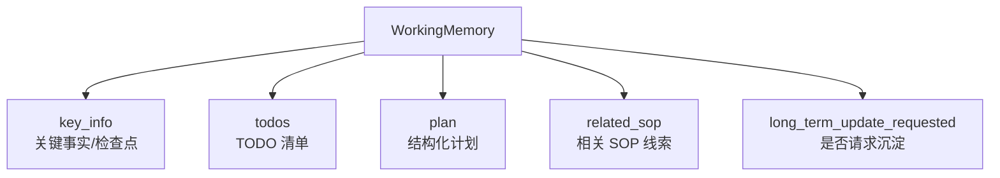
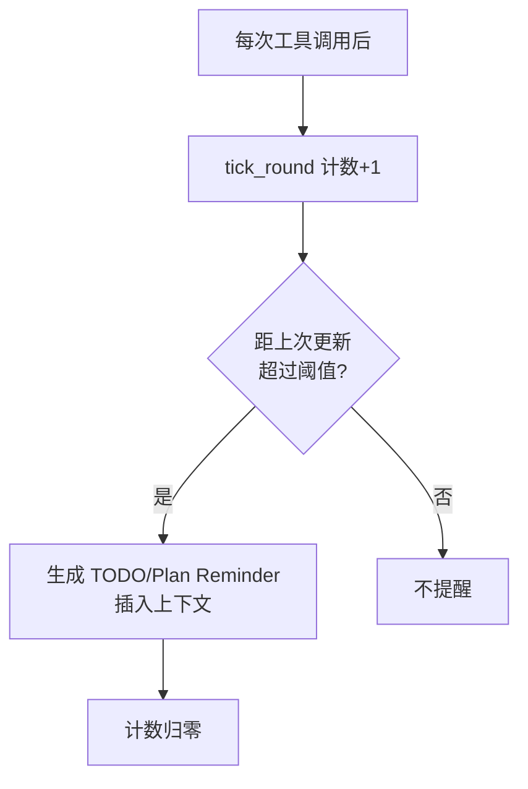
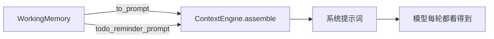

# 第 8 章：工作记忆

模型有个众所周知的毛病：任务一长就"忘事"。读到第八个文件时，它可能忘了最初要做什么；改了一半文件后，它可能重复去改已经改过的地方。

这一章讲 Chrysalis 怎么对付这个问题：`chrysalis/working.py` 里的 `WorkingMemory`——一块专门记录"当前任务做到哪了"的短期记忆。

## 8.1 问题：模型会"忘了自己在干什么"

假设任务是"逐个检查 docs/tutorial 下的 7 篇文档，把不符合规范的列出来"。理想情况下，模型应该：检查第 1 篇 → 记下结果 → 检查第 2 篇……但实际上，随着历史变长（还可能被压缩），模型容易：

- 忘了总共要检查几篇
- 忘了已经检查过哪几篇
- 忘了之前发现的问题
- 在最后汇总时漏掉早期的发现

光靠 LLM History 不够——历史是流水账，模型得自己从一长串消息里"回忆"进度，既费 token 又不可靠。更好的办法是给它一块**结构化的便签**，专门记当前进度。这就是 Working Memory。

::: tip 三种记忆里的"现在"
回忆第 3 章 3.6 节：LLM History 面向过去，长期记忆面向未来复用，**Working Memory 面向当下**——它只关心这一次任务做到哪、下一步做什么。任务一结束就清空（第 2 章 `AgentLoop.run()` 开头的 `self.working.reset()`）。
:::

## 8.2 Working Memory 记什么

`WorkingMemory`（`working.py:112`）维护几类信息：



其中最重要的是两条并行的进度轨道：**TODO**（轻量待办清单）和 **Plan**（结构化计划，带步骤、验收标准、证据）。简单任务用 TODO 就够，复杂的长程任务才用 Plan。

模型通过第 6 章讲的那几个"只返回意图"的工具来更新它：

| 工具 | 更新什么 | WorkingMemory 方法 |
| --- | --- | --- |
| `todo_write` | TODO 清单 | `update_todos()` |
| `update_working_checkpoint` | 关键事实/检查点 | `update_checkpoint()` |
| `start_long_term_update` | 标记值得沉淀 | `request_long_term_update()` |

记住第 2 章 2.6 节的分工：工具只返回 `_todo`/`_checkpoint`/`_long_term` 标记，真正调用上面这些方法的是 `AgentLoop._handle_agent_tool_side_effects()`。

## 8.3 TODO：带状态的待办清单

`update_todos()`（`working.py:172`）支持丰富的操作（action）：`set`（设置）、`append`（追加）、`update`（更新某项）、`complete`（标记完成）、`clear`、`reorder` 等。每个 TODO 项（`TodoItem`）有 id、标题、状态和备注。

一个细节体现了它的用心：每次更新后会调 `_move_completed_to_bottom()`，把已完成的项移到底部。这样模型每次看 TODO，未完成的总在最上面，一眼就知道下一步该干什么。

模型这样调用它：

```json
{"tool": "todo_write", "args": {
  "goal": "检查 7 篇文档",
  "action": "set",
  "todos": "[\"检查 overview\", \"检查 tools\", \"检查 skills\"]"
}}
```

状态会被 `_normalize_status()`（`working.py:38`）归一化——模型写 "done"、"complete"、"已完成" 都会统一成 `completed`，避免因措辞不同导致状态混乱。

## 8.4 Plan：复杂任务的结构化计划

对于真正复杂的长程任务，光有 TODO 清单不够，还需要记录"每一步要达到什么验收标准、有没有证据证明做到了"。这就是 `update_plan()`（`working.py:208`）。

Plan 比 TODO 多了几个维度：

- `plan_steps`：步骤列表
- `plan_acceptance_criteria`：验收标准
- `plan_evidence`：证据（证明某步真的完成了）
- `plan_blocker`：当前卡在哪

它的 action 也更丰富：除了 set/append/update，还有 `satisfy`（满足某条验收标准）、`block`（记录阻塞）、`evidence`（补充证据）。当所有步骤完成时（`_plan_all_done()`），计划状态会自动置为 `completed`。

什么时候用 Plan 而不是 TODO？通常是任务跨很多轮、有明确的验收标准、或者用户明确要求"规划模式"。这部分还和长期记忆里的 `plan_sop.md` 配合（下一章）。

## 8.5 提醒机制：防止模型"忘了看便签"

光有便签还不够——模型可能写完 TODO 后就忘了回头看。所以 Working Memory 有个**提醒机制**。

它记录"距离上次更新 TODO/Plan 过了几轮"（`rounds_since_todo`、`rounds_since_plan`），每轮工具调用后 `tick_round()`（`working.py:287`）累加。当间隔达到阈值（TODO 默认 4 轮，Plan 默认 3 轮），就生成一段提醒插进上下文：



提醒文本由 `todo_reminder_prompt()` / `plan_reminder_prompt()`（`working.py:715`）生成，内容类似"## TODO Reminder：你还有这些未完成项……"。这相当于定期戳一下模型："别忘了你的待办还没做完。"

## 8.6 Working Memory 怎么进入上下文

Working Memory 的内容通过 `to_prompt()`（`working.py:684`）渲染成一段 Markdown（`## 当前短期工作记忆`），由 ContextEngine 注入到每轮请求的系统提示词里。

回忆第 1 章那个 ContextEngine——它在每轮组装上下文时，会把 Working Memory 的当前快照、以及到点的 TODO/Plan 提醒都拼进去。所以模型每一轮都能看到自己的"便签"，不用从历史里费劲回忆。



## 8.7 一个完整例子

把上面串起来，看"检查 7 篇文档"任务里 Working Memory 怎么工作：

```text
任务开始 → working.reset()（清空）
模型调 todo_write 设置 7 个待办 → update_todos()
检查第 1 篇 → 调 todo_write complete 标记第 1 项 → 已完成项沉底
检查第 2 篇 → ...
（过了 4 轮没更新 TODO）→ 自动插入 TODO Reminder 提醒
模型发现一个严重问题 → 调 update_working_checkpoint 记进 key_info
全部检查完 → TODO 全部 completed
模型基于完整的 TODO + key_info 做最终汇总（不会漏）
任务结束 → working 随下次任务 reset 而清空
```

关键价值：模型做最终汇总时，看的是一份**结构化的、已验证的进度清单**，而不是从几万字历史里大海捞针。这就是 Working Memory 让长任务"不丢三落四"的原理。

## 8.8 动手练习

### 练习 A：观察 TODO 的产生

跑一个明显需要分步的任务：

```bash
chrysalis "逐个检查 docs/tutorial 下的 md 文件，列出每篇的标题"
```

如果模型用了 `todo_write`，在会话文件里搜 `todo_write`，看它设置了哪些待办、怎么逐个标记完成。

### 练习 B：理解 reset 的边界

连续跑两个不相关的任务（用单次命令，不是交互模式）。想清楚：第二个任务开始时，第一个任务的 TODO 还在吗？（提示：8.1 节和第 2 章的 `working.reset()`。）这正是 Working Memory 和长期记忆的本质区别。

### 练习 C：读懂提醒阈值

打开 `working.py`，找到 `todo_reminder_interval` 和 `plan_reminder_interval` 两个值。试着把 TODO 的阈值改小（比如 2），跑一个长任务，观察提醒是不是更频繁地出现。理解这个阈值在"提醒够及时"和"不打扰模型"之间的权衡。

---

Working Memory 任务一结束就清空。但有些经验值得跨任务保留——下一章讲长期记忆。

→ [第 9 章：长期记忆](/tutorial/long-term-memory)
